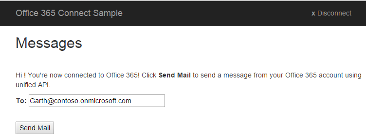

# Aufrufen von Microsoft Graph in einer ASP.NET MVC-App

In diesem Artikel werden Aufgaben beschrieben, die zum Herstellen einer Verbindung zwischen Ihrer Anwendung und Office 365 und zum Aufrufen der Microsoft Graph-API mindestens erforderlich sind. In diesem Thema wird keine App von Grund auf neu erstellt. Wir verwenden den Code aus dem [Office 365 ASP.NET MVC Connect-Beispiel unter Verwendung von Microsoft Graph](https://github.com/microsoftgraph/aspnet-connect-rest-sample), um die wichtigsten Konzepte zu erläutern, die Sie in Ihrer App implementieren müssen.

Im Folgenden finden Sie einen Screenshot der Seite „E-Mail senden“.



## Übersicht

Zum Aufrufen der Microsoft Graph-API müssen Sie die folgenden Aufgaben ausführen.

1. Registrieren der Anwendung in Azure Active Directory
2. Authentifizieren eines Benutzers und Abrufen eines Zugriffstokens durch Aufrufen von Methoden in der Azure AD-Authentifizierungsbibliothek für .NET. (ADAL)
3. Verwenden von ADAL zum Abrufen eines Zugriffstokens
4. Verwenden des Zugriffstokens in einer Anforderung an die Microsoft Graph-API
5. Trennen einer Sitzung

<!--<a name="register"></a>-->
## Registrieren der Anwendung in Azure Active Directory

Bevor Sie  mit Office 365 arbeiten können, müssen Sie Ihre Anwendung registrieren und die Berechtigungen für die Verwendung der Microsoft Graph-Dienste festlegen. 
Mithilfe des [App-Registrierungstools](https://dev.office.com/app-registration) können Sie mit nur wenigen Klicks Ihre Anwendung für den Zugriff auf ein Geschäfts- oder Schulkonto des Benutzers registrieren. Zum Verwalten müssen Sie das [Microsoft Azure-Verwaltungsportal](https://manage.windowsazure.com) verwenden.

Alternative Anweisungen und Informationen dazu, was dabei zu beachten ist, finden Sie unter [Registrieren der browserbasierten Web-App mithilfe des Azure-Verwaltungsportals](https://msdn.microsoft.com/office/office365/HowTo/add-common-consent-manually#bk_RegisterWebApp).

* Geben Sie http://localhost:55065/ als die **Anmelde-URL** an.
* Konfigurieren Sie nach der Registrierung der Anwendung [die **delegierten Berechtigungen**](https://github.com/microsoftgraph/aspnet-connect-rest-sample/wiki/Grant-permissions-to-the-Connect-application-in-Azure), die für Ihre Angular-App erforderlich sind. Für das Connect-Beispiel ist die Berechtigung zum **Senden von E-Mails als angemeldeter Benutzer** erforderlich.

Notieren Sie sich die folgenden Werte auf der Seite **Konfigurieren** in Ihrer Azure-Anwendung, da Sie diese Werte zum Konfigurieren Ihrer App benötigen.

* Client-ID (eindeutig für Ihre Anwendung)
* Schlüssel (auch geheimer Clientschlüssel genannt)
* Eine Antwort-URL (auch Umleitungs-URL genannt). Für dieses Beispiel lautet diese http://localhost:55065/.

  > Hinweis:  Der Wert der Antwort-URL wird automatisch mit dem Wert der Anmelde-URL aufgefüllt, den Sie beim Registrieren der Anwendung angeben.

<!--<a name="#auth"></a>-->
## Authentifizierung im Connect-Beispiel

Mit der Azure AD-Authentifizierungsbibliothek (Azure AD Authentication Library, ADAL) für .NET können Clientanwendungsentwickler Benutzer authentifizieren und dann die Zugriffstoken für API-Aufrufe abrufen.  Sie können diese Bibliothek in Ihrem ASP.NET-MVC-Projekt über **NuGet-Pakete verwalten** in Visual Studio einbeziehen.

Im Folgenden finden Sie einen Screenshot der Startseite.


Der Authentifizierungsfluss wird in zwei grundlegende Schritte unterteilt:

1. Anfordern eines Autorisierungscodes
2. Verwenden des Autorisierungscodes zum Anfordern eines Zugriffstokens.

>  **Hinweis**: Zusammen mit dem Zugriffstoken erhalten Sie ein Aktualisierungstoken. Mit dem Aktualisierungstoken können Sie ein neues Zugriffstoken anfordern, wenn das aktuelle Zugriffstoken abläuft.

Im Connect-Beispiel werden die Azure-App-Registrierungswerte und eine Benutzer-ID für die Authentifizierung verwendet. Für den ADAL-Authentifizierungsfluss sind die Client-ID, der Schlüssel und die Antwort-URL (auch Umleitungs-URL genannt) erforderlich, die Sie während des Registrierungsvorgangs in Azure erhalten haben.

Wenn Sie den Autorisierungscode anfordern möchten, müssen Sie zunächst die App zu der Azure AD-Autorisierungsanforderungs-URL wie folgt umleiten (Siehe HomeController.cs-Datei).


```c#
        public ActionResult Login()
        {
            if (string.IsNullOrEmpty(Settings.ClientId) || string.IsNullOrEmpty(Settings.ClientSecret))
            {
                ViewBag.Message = "Please set your client ID and client secret in the Web.config file";
                return View();
            }


            var authContext = new AuthenticationContext(Settings.AzureADAuthority);

            // Generate the parameterized URL for Azure login.
            Uri authUri = authContext.GetAuthorizationRequestURL(
                Settings.O365UnifiedAPIResource,
                Settings.ClientId,
                loginRedirectUri,
                UserIdentifier.AnyUser,
                null);

            // Redirect the browser to the login page, then come back to the Authorize method below.
            return Redirect(authUri.ToString());
        }

```
Wenn diese **Login**-Methode aufgerufen wird, wird die App den Benutzer zu einer Anmeldeseite umleiten. So wird die App zur Anmeldeseite umgeleitet. Nach erfolgreicher Authentifizierung der Benutzeranmeldeinformationen leitet Azure die App zu der im Code mit *LoginRedirectUri* festgelegten Umleitungs-URL um. Diese Umleitungs-URL ist wie dargestellt eine URL für eine andere Aktion in der ASP.NET MVC-App.

```c#

 Uri loginRedirectUri => new Uri(Url.Action(nameof(Authorize), "Home", null, Request.Url.Scheme));

```
Die URL enthält auch den in Schritt 1 und 2 beschriebenen Autorisierungscode.  Auf diese Weise wird der Autorisierungscode aus den Anforderungsparametern abgerufen. Mithilfe des Autorisierungscodes ruft die App Azure AD auf, um das Zugriffstoken abzurufen. Nach Abrufen des Zugriffstokens wird dieses in der Sitzung gespeichert, damit es für mehrere Anforderungen verwendet werden kann.

Der im Zusammenhang mit der Umleitungs-URL behandelte Autorisierungscode sieht wie folgt aus.

```c#
        public async Task<ActionResult> Authorize()
        {
            var authContext = new AuthenticationContext(Settings.AzureADAuthority);


            // Get the token.
            var authResult = await authContext.AcquireTokenByAuthorizationCodeAsync(
                Request.Params["code"],                                         // the auth 'code' parameter from the Azure redirect.
                loginRedirectUri,                                               // same redirectUri as used before in Login method.
                new ClientCredential(Settings.ClientId, Settings.ClientSecret), // use the client ID and secret to establish app identity.
                Settings.O365UnifiedAPIResource);

            // Save the token in the session.
            Session[SessionKeys.Login.AccessToken] = authResult.AccessToken;

            // Get info about the current logged in user.
            Session[SessionKeys.Login.UserInfo] = await UnifiedApiHelper.GetUserInfoAsync(authResult.AccessToken);

            return RedirectToAction(nameof(Index), "Message");

        }

```
>  **Hinweis**:  Weitere Informationen zum Autorisierungsfluss finden Sie unter [Autorisierung Code Grant-Datenfluss] (https://msdn.microsoft.com/de-de/library/azure/dn645542.aspx).

<!--<a name="request"></a>-->
## Verwenden des Zugriffstokens in einer Anforderung an die Microsoft Graph-API

Nachdem der Benutzer sich angemeldet hat, wird im Connect-Beispiel eine Aktivität zum Senden einer E-Mail angezeigt.  Mit einem Zugriffstoken kann Ihre App authentifizierte Anforderungen an die Microsoft Graph-API senden.

Die Datei „UnifiedApiHelper.cs“ enthält z. B. den Code, mit dem folgende Aktionen durchgeführt werden:

1)  Es werden Informationen zu der aktuellen Benutzeranmeldung abgerufen.  Die ``GetUserInfoAsync``-Methode verwendet ein Argument (Zugriffstokenwert) für einen Aufruf von **https://graph.microsoft.com/v1.0/me**, um Informationen über die aktuelle Benutzeranmeldung abzurufen.

 ```c#

        public static async Task<UserInfo> GetUserInfoAsync(string accessToken)
        {
            UserInfo myInfo = new UserInfo();

            using (var client = new HttpClient())
            {
                using (var request = new HttpRequestMessage(HttpMethod.Get, Settings.GetMeUrl))
                {
                    request.Headers.Accept.Add(Json);
                    request.Headers.Authorization = new AuthenticationHeaderValue("Bearer", accessToken);

                    using (var response = await client.SendAsync(request))
                    {
                        if (response.StatusCode == HttpStatusCode.OK)
                        {
                            var json = JObject.Parse(await response.Content.ReadAsStringAsync());
                            myInfo.Name = json?["displayName"]?.ToString();
                            myInfo.Address = json?["mail"]?.ToString().Trim().Replace(" ", string.Empty);

                        }
                    }
                }
            }

            return myInfo;
        }

```


2)  Es wird die Nachricht erstellt und gesendet, die der Benutzer per E-Mail senden möchte. Die ``SendMessageAsync``-Methode erstellt und sendet eine POST-Anforderung für die **https://graph.microsoft.com/v1.0/me/microsoft.graph.sendmail**-Ressourcen-URL unter Verwendung des Zugriffstokenwerts als eines der Argumente.


```c#

        public static async Task<SendMessageResponse> SendMessageAsync(string accessToken, SendMessageRequest sendMessageRequest)
        {
            var sendMessageResponse = new SendMessageResponse { Status = SendMessageStatusEnum.NotSent };

            using (var client = new HttpClient())
            {
                using (var request = new HttpRequestMessage(HttpMethod.Post, Settings.SendMessageUrl))
                {
                    request.Headers.Authorization = new AuthenticationHeaderValue("Bearer", accessToken);
                    request.Content = new StringContent(JsonConvert.SerializeObject(sendMessageRequest), Encoding.UTF8, "application/json");
                    using (HttpResponseMessage response = await client.SendAsync(request))
                    {
                        if (response.IsSuccessStatusCode)
                        {
                            sendMessageResponse.Status = SendMessageStatusEnum.Sent;
                            sendMessageResponse.StatusMessage = null;
                        }
                        else
                        {
                            sendMessageResponse.Status = SendMessageStatusEnum.Fail;
                            sendMessageResponse.StatusMessage = response.ReasonPhrase;
                        }
                    }
                }
            }

            return sendMessageResponse;
        }

```


Die Datei ``MessageController.cs `` enthält den Code, mit dem die E-Mais verwaltet werden. Zum Beispiel die Schaltfläche **E-Mail senden**. Die ``SendMessageSubmit ``-Methode sendet die Nachricht, wenn der Benutzer auf die Schaltfläche **E-Mail senden** klickt.


```c#

        public async Task<ActionResult> SendMessageSubmit(UserInfo userInfo)
        {
            // After Index method renders the View, user clicks Send Mail, which comes in here.
            EnsureUser(ref userInfo);

            // Send email using O365 unified API.
            var sendMessageResult = await UnifiedApiHelper.SendMessageAsync(
                (string)Session[SessionKeys.Login.AccessToken],
                GenerateEmail(userInfo));

            // Reuse the Index view for messages (sent, not sent, fail) .
            // Redirect to tell the browser to call the app back via the Index method.
            return RedirectToAction(nameof(Index), new RouteValueDictionary(new Dictionary<string,object>{
                { "Status", sendMessageResult.Status },
                { "StatusMessage", sendMessageResult.StatusMessage },
                { "Address", userInfo.Address },
            }));
        }

```


Die ``CreateEmailObject``-Methode erstellt das E-Mail-Objekt im für die POST-Anforderung erforderlichen Anforderungsformat/Datenverkehr:


  ```c#

        private SendMessageRequest CreateEmailObject(UserInfo to, string subject, string body)
        {
            return new SendMessageRequest
            {
                Message = new Message
                {
                    Subject = subject,
                    Body = new MessageBody
                    {
                        ContentType = "Html",
                        Content = body
                    },
                    ToRecipients = new List<Recipient>
                    {
                        new Recipient
                        {
                            EmailAddress = new UserInfo
                            {
                                 Name =  to.Name,
                                 Address = to.Address
                            }
                        }
                    }
                },
                SaveToSentItems = true
            };

```

Eine andere Aufgabe besteht darin, eine gültige JSON-Nachrichtenzeichenfolge zu erstellen und diese an den ``https://graph.microsoft.com/v1.0/me/microsoft.graph.sendmail``-Endpunkt unter Verwendung einer HTTP-POST-Anforderung zu senden. Da der E-Mail-Text als HTML-Dokument gesendet wird, legt die Anforderung den ``ContentType``-Wert der E-Mail auf HTML fest und codiert den Inhalt als JSON für die POST-HTTP-Anforderung. Die Datei „UnifiedApiMessageModels.cs“ enthält den Daten- oder Schemaverkehr zwischen dieser App und dem einheitlichen Office 365-API-Server.


```c#


    public class SendMessageResponse
    {
        public SendMessageStatusEnum Status { get; set; }
        public string StatusMessage { get; set; }
    }

    public class SendMessageRequest
    {
        public Message Message { get; set; }

        public bool SaveToSentItems { get; set; }
    }

    public class Message
    {
        public string Subject { get; set; }
        public MessageBody Body { get; set; }
        public List<Recipient> ToRecipients { get; set; }
    }
    public class Recipient
    {
        public UserInfo EmailAddress { get; set; }
    }

    public class MessageBody
    {
        public string ContentType { get; set; }
        public string Content { get; set; }
    }

    public class UserInfo
    {
        public string Name { get; set; }
        public string Address { get; set; }
    }

}

```
<!--<a name="logout"></a>-->
## Trennen der Sitzung

Wenn der Benutzer auf die Schaltfläche **Trennen** auf der Seite „E-Mail senden“ klickt, wird er von dieser Sitzung abgemeldet. Der Code führt dies durch
* Löschen der lokalen Sitzung
* und Umleiten des Browsers an den Abmeldungsendpunkt (so kann Azure die eigenen Cookies löschen) durch.

Die **Abmelden**-Methode (siehe Datei „HomeController.cs“) veranschaulicht,wie dies funktioniert.


```c#
        public ActionResult Logout()
        {
            Session.Clear();
            return Redirect(Settings.LogoutAuthority + logoutRedirectUri.ToString());
        }

```

##Nächste Schritte
Die Microsoft Graph-API ist eine leistungsfähige einheitliche API, die für die Interaktion mit beliebigen Microsoft-Daten verwendet werden kann. Informationen zu weiteren Möglichkeiten mit der Microsoft Graph-API finden Sie in der API-Referenz. 
Beispiele zu ASP.NET finden Sie unter [GitHub](http://aka.ms/aspnetgraphsamples).


