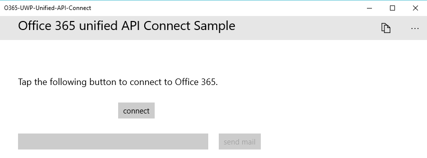
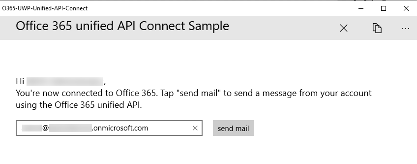

# Aufrufen von Microsoft Graph in einer universellen Windows 10-App

In diesem Artikel werden Aufgaben beschrieben, die zum Abrufen eines Zugriffstokens aus Azure Active Directory (AD) und Aufrufen von Microsoft Graph mindestens erforderlich sind. Wir verwenden den Code aus dem [Office 365 Connect-Beispiel für UWP unter Verwendung von Microsoft Graph](https://github.com/microsoftgraph/uwp-csharp-connect-rest-sample), um die wichtigsten Konzepte zu erläutern, die Sie in Ihrer App implementieren müssen.

## Beispielbenutzeroberfläche

Das Beispiel enthält eine sehr einfache Benutzeroberfläche, die aus einer oberen Befehlsleiste, einer **Schaltfläche zum Herstellen einer Verbindung**, einer Schaltfläche zum **Senden von E-Mails** und aus einem Textfeld besteht, in das die E-Mail-Adresse des angemeldeten Benutzers automatisch eingetragen wird, das jedoch nicht bearbeitet werden kann. Die Befehlsleiste enthält außerdem eine Schaltfläche, über die Entwickler den Umleitungs-URI der App suchen können.

Die Schaltfläche zum **Senden von E-Mails** ist deaktiviert, wenn der Benutzer keine Verbindung hergestellt hat:



Die obere Befehlsleiste enthält eine Schaltfläche zum Trennen der Verbindung, wenn der Benutzer eine Verbindung hergestellt hat:



Die gesamten Zeichenfolgen der Beispielbenutzeroberfläche werden in der Datei „Resources.resw“ innerhalb des Objektordners gespeichert.

## Registrieren der App
 
Windows-10 stellt für jede Anwendung einen eindeutigen URI bereit und stellt sicher, dass an diesen URI gesendete Nachrichten nur an diese Anwendung gesendet werden. Sie müssen Ihre App erstellen und diesen vom System generierten URI suchen, bevor Sie Ihre App registrieren. Im Beispiel finden Sie die folgende Methode in der Datei „AuthenticationHelper.cs“:

```c#
        public static string GetAppRedirectURI()
        {
            // Windows 10 universal apps require redirect URI in the format below. Add a breakpoint to this line and run the app before you register it, so that
            // you can supply the correct redirect URI value.
            return string.Format("ms-appx-web://microsoft.aad.brokerplugin/{0}", WebAuthenticationBroker.GetCurrentApplicationCallbackUri().Host).ToUpper();
        }
```

Diese Methode wird in dem Beispiel von der Schaltfläche **Umleitungs-URI kopieren** ausgelöst, Sie können jedoch auch dem Muster in dem Beispiel [AzureAD-NativeClient-UWP-WAM](https://github.com/Azure-Samples/AzureAD-NativeClient-UWP-WAM) folgen, in dem die Zeichenfolge in der MainPage-Klassendeklaration definiert ist, die Sie mithilfe des Visual Studio Debuggers abrufen können. 

Führen Sie die Schritte unter [Registrieren und Konfigurieren der App](https://github.com/microsoftgraph/uwp-csharp-connect-rest-sample#register) in der Infodatei des Beispiels aus, um die App zu registrieren, nachdem Sie den Wert für den Umleitungs-URI abgerufen haben.

Sie benötigen den Wert für die Client-ID von der Seite **Konfigurieren** Ihrer Azure-Anwendung, wenn Sie die App für die Authentifizierung konfigurieren.

## Verbinden mit Microsoft Graph

Im Beispiel wird die systemeigene WebAccountManager-API von Windows 10 zum Authentifizieren von Benutzern verwendet. Das Beispiel folgt einem ähnlichen Muster wie im Blogbeitrag [Entwickeln von Windows Universal-Apps mit Azure AD und der Identitäts-API von Windows 10](http://blogs.technet.com/b/ad/archive/2015/08/03/develop-windows-universal-apps-with-azure-ad-and-the-windows-10-identity-api.aspx) beschrieben und im Beispiel [AzureAD-NativeClient-UWP-WAM](https://github.com/Azure-Samples/AzureAD-NativeClient-UWP-WAM) veranschaulicht.

Die Datei „App.xaml“ enthält die Schlüssel-/Wertpaare, die Ihre App benötigt, um den Benutzer zu authentifizieren und die App zum Senden einer E-Mail zu autorisieren:

```xml
    <Application.Resources>
        <!-- Add your client id here. -->
        <x:String x:Key="ida:ClientID"><your client id></x:String>
        <x:String x:Key="ida:AADInstance">https://login.microsoftonline.com/</x:String>
        <!-- Add your developer tenant domain here. -->
        <x:String x:Key="ida:Domain">yourtenant.onmicrosoft.com</x:String>
    </Application.Resources>
```

Fügen Sie den Wert der Client-ID, den Sie beim Registrieren der App erhalten haben, als Wert für den Schlüssel **ida: ClientID** hinzu. Ändern Sie den Wert des Schlüssels **ida:Domain** so, dass er mit Ihrem Office 365-Mandanten übereinstimmt.

Die Datei „AuthenticationHelper.cs“ enthält den gesamten Authentifizierungscode sowie zusätzliche Logik, die Benutzerinformationen speichert und die Authentifizierung nur dann erzwingt, wenn der Benutzer die Verbindung zu der App getrennt hat.

Die in dieser Datei definierte ``GetTokenHelperAsync``-Methode wird ausgeführt, wenn der Benutzer sich authentifiziert und anschließend jedes Mal, wenn die App Microsoft Graph aufruft. Die erste Aufgabe besteht darin, einen Azure AD-Kontoanbieter finden:

```c#
           aadAccountProvider = await WebAuthenticationCoreManager.FindAccountProviderAsync("https://login.microsoft.com", authority);
```

Der Wert von ``authority`` ist eine verkettete Zeichenfolge, die aus zwei Werten besteht, die in der Datei „App.xaml“ gespeichert sind: der Wert des Schlüssels **ida:AADInstance** plus dem Wert des Schlüssels **ida: Domain**. Dadurch wird eine mandantenspezifische Authority erstellt. Sie können auch die Zeichenfolge "organizations" verwenden, wenn Sie möchten, dass Ihre App auf einem beliebigen Azure AD-Mandanten ausgeführt wird.

Nachdem der Benutzer authentifiziert wurde, speichert die App den Wert der Benutzer-ID in ``ApplicationData.Current.RoamingSettings``. Die ``GetTokenHelperAsync``-Methode überprüft zunächst, ob dieser Wert vorhanden ist. Wenn ja, wird versucht, eine Authentifizierung im Hintergrund auszuführen:

```c#
            // Check if there's a record of the last account used with the app
            var userID = _settings.Values["userID"];

            if (userID != null)
            {

                WebTokenRequest webTokenRequest = new WebTokenRequest(aadAccountProvider, string.Empty, clientId);
                webTokenRequest.Properties.Add("resource", ResourceUrl);

                // Get an account object for the user
                userAccount = await WebAuthenticationCoreManager.FindAccountAsync(aadAccountProvider, (string)userID);


                // Ensure that the saved account works for getting the token we need
                WebTokenRequestResult webTokenRequestResult = await WebAuthenticationCoreManager.RequestTokenAsync(webTokenRequest, userAccount);
                if (webTokenRequestResult.ResponseStatus == WebTokenRequestStatus.Success || webTokenRequestResult.ResponseStatus == WebTokenRequestStatus.AccountSwitch)
                {
                    WebTokenResponse webTokenResponse = webTokenRequestResult.ResponseData[0];
                    userAccount = webTokenResponse.WebAccount;
                    token = webTokenResponse.Token;

                }
                else
                {
                    // The saved account could not be used for getting a token
                    // Make sure that the UX is ready for a new sign in
                    SignOut();
                }

            }
```

Die App verwendet den Microsoft Graph-Endpunkt – **https://graph.microsoft.com/** – als Ressourcenwert. Bei der Erstellung von ``WebTokenRequest`` wird der Wert der Client-ID verwendet, den Sie der Datei „App.xaml“ hinzugefügt haben. Da die App die Benutzer-ID kennt und der Benutzer die Verbindung nicht getrennt hat, kann die WebAccountManager-API das Benutzerkonto suchen und es an die Tokenanforderung übergeben. Die ``WebAuthenticationCoreManager.RequestTokenAsync``-Methode gibt ein Zugriffstoken mit den entsprechenden Berechtigungen zurück.

Wenn die App keinen Wert für ``userID`` in den Roamingeinstellungen findet, wird ein ``WebTokenRequest`` erstellt, wodurch die Authentifizierung des Benutzers über die Benutzeroberfläche erzwungen wird:

```c#
            else
            {
                // There is no recorded user. Start a sign in flow without imposing a specific account.

                WebTokenRequest webTokenRequest = new WebTokenRequest(aadAccountProvider, string.Empty, clientId, WebTokenRequestPromptType.ForceAuthentication);
                webTokenRequest.Properties.Add("resource", ResourceUrl);

                WebTokenRequestResult webTokenRequestResult = await WebAuthenticationCoreManager.RequestTokenAsync(webTokenRequest);
                if (webTokenRequestResult.ResponseStatus == WebTokenRequestStatus.Success)
                {
                    WebTokenResponse webTokenResponse = webTokenRequestResult.ResponseData[0];
                    userAccount = webTokenResponse.WebAccount;
                    token = webTokenResponse.Token;

                }
            }
```

Wenn einer der Versuche des Abrufens eines Tokens erfolgreich ist, wird die ``GetTokenHelperAsync``-Methode abgeschlossen, indem wichtige Benutzerinformationen in den Roamingeinstellungen gespeichert und dann der Tokenwert zurückgegeben wird. Andernfalls wird sichergestellt, dass die Roamingeinstellungen Null sind, und es wird ein Nullwert zurückgegeben.

```c#
            // We succeeded in getting a valid user.
            if (userAccount != null)
            {
                // save user ID in local storage
                _settings.Values["userID"] = userAccount.Id;
                _settings.Values["userEmail"] = userAccount.UserName;
                _settings.Values["userName"] = userAccount.Properties["DisplayName"];

                return token;
            }

            // We didn't succeed in getting a valid user. Clear the app settings so that another user can sign in.
            else
            {
                
                SignOut();
                return null;
            }
```

## Senden einer E-Mail mit Microsoft Graph

Die Datei „MailHelper.cs“ enthält den Code, durch den eine E-Mail erstellt und gesendet wird. Er besteht aus einer einzigen Methode, ``ComposeAndSendMailAsync``, die eine POST-Anforderung konstruiert und an den **https://graph.microsoft.com/v1.0/me/microsoft.graph.SendMail**-Endpunkt sendet. 

Die ``ComposeAndSendMailAsync``-Methode verwendet die drei Zeichenfolgenwerte ``subject``, ``bodyContent`` und ``recipients``, die von der Datei „MainPage.xaml.cs“ an sie übergeben werden. Die Zeichenfolgen ``subject`` und ``bodyContent`` werden zusammen mit allen anderen Benutzeroberflächenzeichenfolgen in der Datei „Resources.resw“ gespeichert. Die Zeichenfolge ``recipients`` stammt aus dem Adressfeld in der App-Schnittstelle. 

Da der Benutzer mehrere Adressen übergeben kann, besteht die erste Aufgabe darin, die Zeichenfolge ``recipients`` in einen Satz von EmailAddress-Objekten zu unterteilen, die dann im POST-Text der Anforderung übergeben werden können.

```c#
            // Prepare the recipient list
            string[] splitter = { ";" };
            var splitRecipientsString = recipients.Split(splitter, StringSplitOptions.RemoveEmptyEntries);
            string recipientsJSON = null;

            int n = 0;
            foreach (string recipient in splitRecipientsString)
            {
                if ( n==0)
                recipientsJSON += "{'EmailAddress':{'Address':'" + recipient.Trim() + "'}}";
                else
                {
                    recipientsJSON += ", {'EmailAddress':{'Address':'" + recipient.Trim() + "'}}";
                }
                n++;
            }
```

Die zweite Aufgabe besteht darin, ein gültiges JSON-Nachrichtenobjekt zu erstellen und dieses über eine HTTP-POST-Anforderung an den **me/microsoft.graph.SendMail**-Endpunkt zu senden. Da die Zeichenfolge  ``bodyContent`` ein HTML-Dokument ist, legt die Anforderung den Wert **ContentType** auf HTML fest. Beachten Sie auch den Aufruf von ``AuthenticationHelper.GetTokenHelperAsync``, womit sichergestellt wird, dass in der Anforderung ein neues Zugriffstoken zum Übergeben vorhanden ist.

```c#
                HttpClient client = new HttpClient();
                var token = await AuthenticationHelper.GetTokenHelperAsync();
                client.DefaultRequestHeaders.Add("Authorization", "Bearer " + token);

                // Build contents of post body and convert to StringContent object.
                // Using line breaks for readability.
                string postBody = "{'Message':{" 
                    +  "'Body':{ " 
                    + "'Content': '" + bodyContent + "'," 
                    + "'ContentType':'HTML'}," 
                    + "'Subject':'" + subject + "'," 
                    + "'ToRecipients':[" + recipientsJSON +  "]}," 
                    + "'SaveToSentItems':true}";

                var emailBody = new StringContent(postBody, System.Text.Encoding.UTF8, "application/json");

                HttpResponseMessage response = await client.PostAsync(new Uri("https://graph.microsoft.com/v1.0/me/microsoft.graph.SendMail"), emailBody);

                if ( !response.IsSuccessStatusCode)
                {

                    throw new Exception("We could not send the message: " + response.StatusCode.ToString());
                }
```

Nachdem Sie eine erfolgreiche REST-Anforderung ausgeführt haben, haben Sie die drei erforderlichen Schritte für die Interaktion mit Microsoft Graph durchgeführt: App-Registrierung, Benutzerauthentifizierung und eine REST-Anforderung.


<!--## Additional resources

* [Develop Windows Universal Apps with Azure AD and the Windows 10 Identity API](http://blogs.technet.com/b/ad/archive/2015/08/03/develop-windows-universal-apps-with-azure-ad-and-the-windows-10-identity-api.aspx)
* [AzureAD-NativeClient-UWP-WAM](https://github.com/Azure-Samples/AzureAD-NativeClient-UWP-WAM)
* [Office Dev Center](http://dev.office.com)-->

