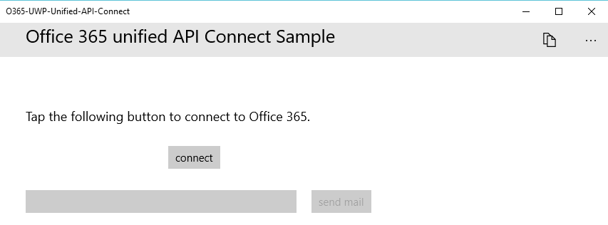
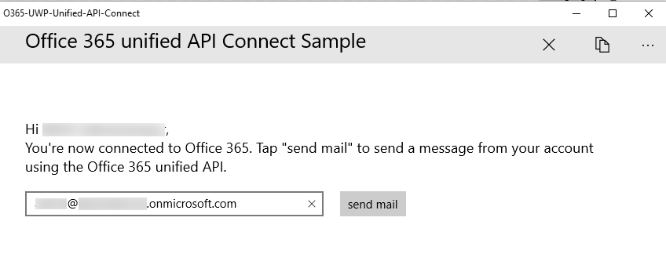

# Appel de Microsoft Graph dans une application Windows 10 universelle

Dans cet article, nous examinons les tâches minimales requises pour obtenir un jeton d’accès d’Azure Active Directory (AD) et appeler Microsoft Graph. Nous utilisons le code de l’[exemple de connexion d’UWP à Office 365 à l’aide de Microsoft Graph](https://github.com/microsoftgraph/uwp-csharp-connect-rest-sample) pour expliquer les concepts principaux que vous devez mettre en œuvre dans votre application.

## Exemple d’interface utilisateur

L’exemple contient une interface utilisateur très simple, constituée d’une barre de commandes supérieure, d’un **bouton de connexion**, d’un bouton d’**envoi du message** et d’une zone de texte qui est renseignée automatiquement avec l’adresse électronique de l’utilisateur connecté, mais qui peut être modifiée. La barre de commandes contient également un bouton qui permet aux développeurs de trouver l’URI de redirection de l’application.

Le bouton d’**envoi du message** est désactivé lorsque l’utilisateur ne s’est pas connecté :



La barre de commandes supérieure contient un bouton de déconnexion lorsque l’utilisateur s’est connecté :



Toutes les chaînes de l’exemple d’interface utilisateur sont stockées dans le fichier Resources.resw du dossier Assets.

## Inscription de l’application
 
Windows 10 fournit un URI unique à chaque application et vérifie que les messages envoyés à cet URI sont envoyés uniquement à cette application. Vous devez créer votre application et trouver cet URI généré par le système avant d’inscrire votre application. Dans l’exemple, vous trouverez cette méthode dans le fichier AuthenticationHelper.cs :

```c#
        public static string GetAppRedirectURI()
        {
            // Windows 10 universal apps require redirect URI in the format below. Add a breakpoint to this line and run the app before you register it, so that
            // you can supply the correct redirect URI value.
            return string.Format("ms-appx-web://microsoft.aad.brokerplugin/{0}", WebAuthenticationBroker.GetCurrentApplicationCallbackUri().Host).ToUpper();
        }
```

Cette méthode est déclenchée dans l’exemple par le bouton de **copie de l’URI de redirection**, mais vous pouvez aussi suivre le modèle de l’exemple [AzureAD-NativeClient-UWP-WAM](https://github.com/Azure-Samples/AzureAD-NativeClient-UWP-WAM), dans lequel la chaîne est définie dans la déclaration de classe MainPage et vous pouvez l’extraire à l’aide du débogueur Visual Studio. 

Suivez les étapes de la section relative à l’[inscription et à la configuration de l’application](https://github.com/microsoftgraph/uwp-csharp-connect-rest-sample#register) du fichier Lisez-moi de l’exemple pour inscrire votre application une fois que vous avez obtenu la valeur de l’URI de redirection.

Vous aurez besoin de la valeur de l’ID client de la page de **configuration** de votre application Azure lorsque vous configurerez votre application pour l’authentification.

## Connexion à Microsoft Graph

L’exemple utilise l’API WebAccountManager de Windows 10 native pour authentifier les utilisateurs. Il s’ensuit un modèle semblable à celui décrit dans le billet de blog relatif au [développement d’applications Windows universelles avec Azure AD et l’API d’identité de Windows 10](http://blogs.technet.com/b/ad/archive/2015/08/03/develop-windows-universal-apps-with-azure-ad-and-the-windows-10-identity-api.aspx) et illustré dans les exemples [AzureAD-NativeClient-UWP-WAM](https://github.com/Azure-Samples/AzureAD-NativeClient-UWP-WAM).

Le fichier App.xaml contient les paires clé/valeur requises par votre application pour authentifier l’utilisateur et autoriser l’application à envoyer un message électronique :

```xml
    <Application.Resources>
        <!-- Add your client id here. -->
        <x:String x:Key="ida:ClientID"><your client id></x:String>
        <x:String x:Key="ida:AADInstance">https://login.microsoftonline.com/</x:String>
        <!-- Add your developer tenant domain here. -->
        <x:String x:Key="ida:Domain">yourtenant.onmicrosoft.com</x:String>
    </Application.Resources>
```

Ajoutez la valeur d’ID client obtenue lorsque vous avez inscrit votre application comme valeur pour la clé **ida:ClientID**. Modifiez la valeur de la clé **ida:Domain**, afin qu’elle corresponde à votre client Office 365.

Le fichier AuthenticationHelper.cs contient tout le code d’authentification, ainsi que la logique supplémentaire qui stocke les informations utilisateur et force l’authentification uniquement lorsque l’utilisateur s’est déconnecté de l’application.

La méthode ``GetTokenHelperAsync`` définie dans ce fichier s’exécute lorsque l’utilisateur s’authentifie et par la suite, chaque fois que l’application effectue un appel à Microsoft Graph. Sa première tâche consiste à rechercher un fournisseur de compte Azure AD :

```c#
           aadAccountProvider = await WebAuthenticationCoreManager.FindAccountProviderAsync("https://login.microsoft.com", authority);
```

La valeur de ``authority`` est une chaîne concaténée créée à partir de deux valeurs stockées dans le fichier App.xaml : la valeur de la clé **ida:AADInstance** plus la valeur de la clé **ida:Domain**. Cela crée une autorité propre au client. Vous pouvez également utiliser la chaîne « organizations » si vous souhaitez que votre application s’exécute sur n’importe quel client Azure AD.

Une fois que l’utilisateur s’est authentifié, l’application stocke la valeur de l’ID utilisateur dans ``ApplicationData.Current.RoamingSettings``. La méthode ``GetTokenHelperAsync`` vérifie d’abord si cette valeur existe, et si tel est le cas, tente d’authentifier en silence :

```c#
            // Check if there's a record of the last account used with the app
            var userID = _settings.Values["userID"];

            if (userID != null)
            {

                WebTokenRequest webTokenRequest = new WebTokenRequest(aadAccountProvider, string.Empty, clientId);
                webTokenRequest.Properties.Add("resource", ResourceUrl);

                // Get an account object for the user
                userAccount = await WebAuthenticationCoreManager.FindAccountAsync(aadAccountProvider, (string)userID);


                // Ensure that the saved account works for getting the token we need
                WebTokenRequestResult webTokenRequestResult = await WebAuthenticationCoreManager.RequestTokenAsync(webTokenRequest, userAccount);
                if (webTokenRequestResult.ResponseStatus == WebTokenRequestStatus.Success || webTokenRequestResult.ResponseStatus == WebTokenRequestStatus.AccountSwitch)
                {
                    WebTokenResponse webTokenResponse = webTokenRequestResult.ResponseData[0];
                    userAccount = webTokenResponse.WebAccount;
                    token = webTokenResponse.Token;

                }
                else
                {
                    // The saved account could not be used for getting a token
                    // Make sure that the UX is ready for a new sign in
                    SignOut();
                }

            }
```

L’application utilise le point de terminaison Microsoft Graph -- **https://graph.microsoft.com/** -- en tant que valeur de la ressource. Lors de la création de ``WebTokenRequest``, elle utilise la valeur de l’ID client que vous avez ajoutée au fichier App.xaml. Étant donné que l’application connaît l’ID utilisateur et que l’utilisateur ne s’est pas déconnecté, l’API WebAccountManager peut rechercher le compte d’utilisateur et le transférer à la demande de jeton. La méthode ``WebAuthenticationCoreManager.RequestTokenAsync`` renvoie un jeton d’accès avec les autorisations appropriées qui lui sont affectées.

Si l’application ne trouve aucune valeur pour ``userID`` dans les paramètres d’itinérance, elle crée ``WebTokenRequest`` qui force l’utilisateur à s’authentifier via l’interface utilisateur :

```c#
            else
            {
                // There is no recorded user. Start a sign in flow without imposing a specific account.

                WebTokenRequest webTokenRequest = new WebTokenRequest(aadAccountProvider, string.Empty, clientId, WebTokenRequestPromptType.ForceAuthentication);
                webTokenRequest.Properties.Add("resource", ResourceUrl);

                WebTokenRequestResult webTokenRequestResult = await WebAuthenticationCoreManager.RequestTokenAsync(webTokenRequest);
                if (webTokenRequestResult.ResponseStatus == WebTokenRequestStatus.Success)
                {
                    WebTokenResponse webTokenResponse = webTokenRequestResult.ResponseData[0];
                    userAccount = webTokenResponse.WebAccount;
                    token = webTokenResponse.Token;

                }
            }
```

Si la tentative de récupération d’un jeton réussit, la méthode ``GetTokenHelperAsync`` se termine en stockant les informations utilisateur importantes dans les paramètres d’itinérance puis renvoie la valeur du jeton. Sinon, elle vérifie que les paramètres d’itinérance sont null et renvoie une valeur null.

```c#
            // We succeeded in getting a valid user.
            if (userAccount != null)
            {
                // save user ID in local storage
                _settings.Values["userID"] = userAccount.Id;
                _settings.Values["userEmail"] = userAccount.UserName;
                _settings.Values["userName"] = userAccount.Properties["DisplayName"];

                return token;
            }

            // We didn't succeed in getting a valid user. Clear the app settings so that another user can sign in.
            else
            {
                
                SignOut();
                return null;
            }
```

## Envoi d’un message électronique avec Microsoft Graph

Le fichier MailHelper.cs contient le code qui crée et envoie un message électronique. Il se compose d’une seule méthode -- ``ComposeAndSendMailAsync`` -- qui crée une demande POST et l’envoie au point de terminaison **https://graph.microsoft.com/v1.0/me/microsoft.graph.SendMail**. 

La méthode ``ComposeAndSendMailAsync`` prend trois valeurs de chaîne (``subject``, ``bodyContent`` et ``recipients``) qui lui sont transmises par le fichier MainPage.xaml.cs. Les chaînes ``subject`` et ``bodyContent`` sont stockées, ainsi que toutes les autres chaînes de l’interface utilisateur, dans le fichier Resources.resw. La chaîne ``recipients`` provient de la zone d’adresse dans l’interface de l’application. 

Étant donné que l’utilisateur peut potentiellement transmettre plusieurs adresses, la première tâche consiste à diviser la chaîne ``recipients`` en un ensemble d’objets EmailAddress pouvant ensuite être transmis dans le corps POST de la requête :

```c#
            // Prepare the recipient list
            string[] splitter = { ";" };
            var splitRecipientsString = recipients.Split(splitter, StringSplitOptions.RemoveEmptyEntries);
            string recipientsJSON = null;

            int n = 0;
            foreach (string recipient in splitRecipientsString)
            {
                if ( n==0)
                recipientsJSON += "{'EmailAddress':{'Address':'" + recipient.Trim() + "'}}";
                else
                {
                    recipientsJSON += ", {'EmailAddress':{'Address':'" + recipient.Trim() + "'}}";
                }
                n++;
            }
```

La deuxième tâche consiste à construire un objet Message JSON valide et à l’envoyer au point de terminaison **me/microsoft.graph.SendMail** via une requête HTTP POST. Dans la mesure où la chaîne ``bodyContent`` est un document HTML, la requête définit la valeur **ContentType** sur HTML. Notez également l’appel vers ``AuthenticationHelper.GetTokenHelperAsync`` pour vous assurer que nous disposons d’un nouveau jeton d’accès à transmettre dans la requête.

```c#
                HttpClient client = new HttpClient();
                var token = await AuthenticationHelper.GetTokenHelperAsync();
                client.DefaultRequestHeaders.Add("Authorization", "Bearer " + token);

                // Build contents of post body and convert to StringContent object.
                // Using line breaks for readability.
                string postBody = "{'Message':{" 
                    +  "'Body':{ " 
                    + "'Content': '" + bodyContent + "'," 
                    + "'ContentType':'HTML'}," 
                    + "'Subject':'" + subject + "'," 
                    + "'ToRecipients':[" + recipientsJSON +  "]}," 
                    + "'SaveToSentItems':true}";

                var emailBody = new StringContent(postBody, System.Text.Encoding.UTF8, "application/json");

                HttpResponseMessage response = await client.PostAsync(new Uri("https://graph.microsoft.com/v1.0/me/microsoft.graph.SendMail"), emailBody);

                if ( !response.IsSuccessStatusCode)
                {

                    throw new Exception("We could not send the message: " + response.StatusCode.ToString());
                }
```

Une fois la requête REST réussie, vous avez effectué les trois étapes nécessaires pour interagir avec Microsoft Graph : inscription de l’application, authentification de l’utilisateur et exécution d’une requête REST.


<!--## Additional resources

* [Develop Windows Universal Apps with Azure AD and the Windows 10 Identity API](http://blogs.technet.com/b/ad/archive/2015/08/03/develop-windows-universal-apps-with-azure-ad-and-the-windows-10-identity-api.aspx)
* [AzureAD-NativeClient-UWP-WAM](https://github.com/Azure-Samples/AzureAD-NativeClient-UWP-WAM)
* [Office Dev Center](http://dev.office.com)-->

