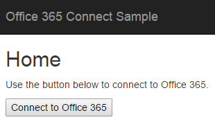

# ASP.NET MVC アプリで Microsoft Graph を呼び出す

この記事では、アプリケーションを Office 365 に接続し、Microsoft Graph AP を呼び出すために必要な最低限のタスクについて説明します。このトピックでは、アプリケーションを一から作成するわけではありません。[Microsoft Graph を使用する Office 365 ASP.NET MVC 接続サンプル](https://github.com/microsoftgraph/aspnet-connect-rest-sample)のコードを使用して、アプリに実装する必要のある主要な概念を説明します。

メール送信ページのスクリーンショットを次に示します。


## 概要

Microsoft Graph API を呼び出すには、次のタスクを完了する必要があります。

1. Azure Active Directory にアプリケーションを登録する
2. Azure AD Authentication Library for .NET のメソッドを呼び出すことにより、ユーザーを認証してアクセス トークンを取得します。(ADAL)
3. ADAL を使用してアクセス トークンを取得する
4. Microsoft Graph API への要求にアクセス トークンを使用する
5. セッションを切断する

<!--<a name="register"></a>-->
## Azure Active Directory にアプリケーションを登録する

Office 365 を使用する前に、アプリケーションを登録し、Microsoft Graph のサービスを使用するアクセス許可を設定する必要があります。数回クリックするだけで、
[アプリケーションの登録ツール](https://dev.office.com/app-registration)を使用して、アプリケーションを登録しユーザーの職場または学校のアカウントにアクセスすることができます。これを管理するには、[Microsoft Azure の管理ポータル](https://manage.windowsazure.com)に移動する必要があります

他の手順については、「[Azure 管理ポータルでブラウザーベースの Web アプリを登録する](https://msdn.microsoft.com/office/office365/HowTo/add-common-consent-manually#bk_RegisterWebApp)」をご覧ください。以下の詳細な点にご注意ください。

* **サインオン URL** として、必ず http://localhost:55065/ を指定してください。
* アプリケーションを登録した後、Angular アプリで必要な[**委任されたアクセス許可**を設定](https://github.com/microsoftgraph/aspnet-connect-rest-sample/wiki/Grant-permissions-to-the-Connect-application-in-Azure)します。接続サンプルには、**サインインしているユーザーとしてメールを送信する**アクセス許可が必要です。

Azure アプリケーションの **[構成]** ページの次の値をメモしてください。アプリに構成する必要があります。

* クライアント ID (アプリケーションで一意)
* キー (クライアント シークレットとも呼ばれる)
* 応答 URL (リダイレクト URL とも呼ばれる)。このサンプルでは http://localhost:55065/ です。

  > 注:応答 URL の値には、アプリケーションを登録するときに指定するサインオン URL 値が自動的に入力されることもあります。

<!--<a name="#auth"></a>-->
## 接続サンプルでの認証

Azure AD Authentication Library (ADAL) for .NET により、クライアント アプリケーションの開発者はユーザーを認証し、API 呼び出しを実行するアクセス トークンを取得します。このライブラリは、Visual Studio の **Manage NuGet パッケージ**でも ASP.NET MVC プロジェクトに取り込むことができます。

ホーム ページのスクリーンショットを次に示します。



認証フローは 2 つの基本的な手順に分割できます。

1. 認証コードを要求する
2. 認証コードを使用して、アクセス トークンを要求します。

>  **注**:アクセス トークンとともに更新トークンも取得します。更新トークンを使用して、現在のアクセス トークンの有効期限が切れたときに新しいアクセス トークンを取得することができます。

接続サンプルでは、Azure アプリの登録値とユーザーの ID を認証に使用します。ADAL の認証フローには Azure の登録プロセスで取得するクライアント ID、キー、応答 URL (リダイレクト URL とも呼ばれる) が必要です。

認証コードを要求するには、次に示すように、最初にアプリを Azure AD 承認要求 URL にリダイレクトします (HomeController.cs ファイルを参照してください)。


```c#
        public ActionResult Login()
        {
            if (string.IsNullOrEmpty(Settings.ClientId) || string.IsNullOrEmpty(Settings.ClientSecret))
            {
                ViewBag.Message = "Please set your client ID and client secret in the Web.config file";
                return View();
            }


            var authContext = new AuthenticationContext(Settings.AzureADAuthority);

            // Generate the parameterized URL for Azure login.
            Uri authUri = authContext.GetAuthorizationRequestURL(
                Settings.O365UnifiedAPIResource,
                Settings.ClientId,
                loginRedirectUri,
                UserIdentifier.AnyUser,
                null);

            // Redirect the browser to the login page, then come back to the Authorize method below.
            return Redirect(authUri.ToString());
        }

```
この **ログイン** メソッドが呼び出されると、アプリがサインイン ページにユーザーをリダイレクトします。これにより、アプリがログイン ページに移動します。ユーザー資格証明が認証されると、Azure は、コードに *loginRedirectUri* で指定されて記載されているリダイレクト URL にアプリをリダイレクトします。このリダイレクト URL は、示されているとおり、ASP.NET MVC アプリ内の別のアクションへの URL です。

```c#

 Uri loginRedirectUri => new Uri(Url.Action(nameof(Authorize), "Home", null, Request.Url.Scheme));

```
URL には、上記の手順 1 と 2 に示す認証コードも格納されます。これにより、要求パラメーターから認証コードを取得します。認証コードを使用して、アプリはアクセス トークンを取得するため Azure AD への呼び出しを行います。アクセス トークンを取得したら、複数の要求に使用できるようセッション内に格納します。

リダイレクト URL アクションに記載されている承認アクションは次のようになります。

```c#
        public async Task<ActionResult> Authorize()
        {
            var authContext = new AuthenticationContext(Settings.AzureADAuthority);


            // Get the token.
            var authResult = await authContext.AcquireTokenByAuthorizationCodeAsync(
                Request.Params["code"],                                         // the auth 'code' parameter from the Azure redirect.
                loginRedirectUri,                                               // same redirectUri as used before in Login method.
                new ClientCredential(Settings.ClientId, Settings.ClientSecret), // use the client ID and secret to establish app identity.
                Settings.O365UnifiedAPIResource);

            // Save the token in the session.
            Session[SessionKeys.Login.AccessToken] = authResult.AccessToken;

            // Get info about the current logged in user.
            Session[SessionKeys.Login.UserInfo] = await UnifiedApiHelper.GetUserInfoAsync(authResult.AccessToken);

            return RedirectToAction(nameof(Index), "Message");

        }

```
>  **注**:承認フローの詳細については、[認証コード付与フロー] (https://msdn.microsoft.com/ja-jp/library/azure/dn645542.aspx) を参照してください。

<!--<a name="request"></a>-->
## Microsoft Graph API への要求にアクセス トークンを使用する

ユーザーがサインインすると、接続サンプルはメール メッセージを送信するアクティビティをユーザーに表示します。アクセス トークンを使用することにより、アプリで、Microsoft Graph API への認証された要求を作成できます。

たとえば、UnifiedApiHelper.cs ファイルには次のコードが含まれます。

1)  現在のログイン ユーザーに関する情報を取得します。``GetUserInfoAsync`` メソッドでは、単一の引数 (アクセス トークン値) を取り、現在のログイン ユーザーに関する情報を取得するため、**https://graph.microsoft.com/v1.0/me** への呼び出しを行います。

 ```c#

        public static async Task<UserInfo> GetUserInfoAsync(string accessToken)
        {
            UserInfo myInfo = new UserInfo();

            using (var client = new HttpClient())
            {
                using (var request = new HttpRequestMessage(HttpMethod.Get, Settings.GetMeUrl))
                {
                    request.Headers.Accept.Add(Json);
                    request.Headers.Authorization = new AuthenticationHeaderValue("Bearer", accessToken);

                    using (var response = await client.SendAsync(request))
                    {
                        if (response.StatusCode == HttpStatusCode.OK)
                        {
                            var json = JObject.Parse(await response.Content.ReadAsStringAsync());
                            myInfo.Name = json?["displayName"]?.ToString();
                            myInfo.Address = json?["mail"]?.ToString().Trim().Replace(" ", string.Empty);

                        }
                    }
                }
            }

            return myInfo;
        }

```


2)  ログインしたユーザーがメールで送信するメッセージを作成しメッセージを送信します。``SendMessageAsync`` メソッドは、引数の 1 つとしてアクセス トークン値を使用して POST 要求を作成し、それを **https://graph.microsoft.com/v1.0/me/microsoft.graph.sendmail** リソース URL に送信します。


```c#

        public static async Task<SendMessageResponse> SendMessageAsync(string accessToken, SendMessageRequest sendMessageRequest)
        {
            var sendMessageResponse = new SendMessageResponse { Status = SendMessageStatusEnum.NotSent };

            using (var client = new HttpClient())
            {
                using (var request = new HttpRequestMessage(HttpMethod.Post, Settings.SendMessageUrl))
                {
                    request.Headers.Authorization = new AuthenticationHeaderValue("Bearer", accessToken);
                    request.Content = new StringContent(JsonConvert.SerializeObject(sendMessageRequest), Encoding.UTF8, "application/json");
                    using (HttpResponseMessage response = await client.SendAsync(request))
                    {
                        if (response.IsSuccessStatusCode)
                        {
                            sendMessageResponse.Status = SendMessageStatusEnum.Sent;
                            sendMessageResponse.StatusMessage = null;
                        }
                        else
                        {
                            sendMessageResponse.Status = SendMessageStatusEnum.Fail;
                            sendMessageResponse.StatusMessage = response.ReasonPhrase;
                        }
                    }
                }
            }

            return sendMessageResponse;
        }

```


``MessageController.cs `` ファイルには、メール メッセージを管理するコードが含まれています。たとえば、**[メールを送信]** ボタンなどです。``SendMessageSubmit `` メソッドは、ユーザーが **[メールを送信]** ボタンをクリックしたときにメッセージを送信します。


```c#

        public async Task<ActionResult> SendMessageSubmit(UserInfo userInfo)
        {
            // After Index method renders the View, user clicks Send Mail, which comes in here.
            EnsureUser(ref userInfo);

            // Send email using O365 unified API.
            var sendMessageResult = await UnifiedApiHelper.SendMessageAsync(
                (string)Session[SessionKeys.Login.AccessToken],
                GenerateEmail(userInfo));

            // Reuse the Index view for messages (sent, not sent, fail) .
            // Redirect to tell the browser to call the app back via the Index method.
            return RedirectToAction(nameof(Index), new RouteValueDictionary(new Dictionary<string,object>{
                { "Status", sendMessageResult.Status },
                { "StatusMessage", sendMessageResult.StatusMessage },
                { "Address", userInfo.Address },
            }));
        }

```


``CreateEmailObject`` メソッドは、POST 本文が必要とする必須の要求形式とデータ コントラクトでメール オブジェクトを作成します。


  ```c#

        private SendMessageRequest CreateEmailObject(UserInfo to, string subject, string body)
        {
            return new SendMessageRequest
            {
                Message = new Message
                {
                    Subject = subject,
                    Body = new MessageBody
                    {
                        ContentType = "Html",
                        Content = body
                    },
                    ToRecipients = new List<Recipient>
                    {
                        new Recipient
                        {
                            EmailAddress = new UserInfo
                            {
                                 Name =  to.Name,
                                 Address = to.Address
                            }
                        }
                    }
                },
                SaveToSentItems = true
            };

```

別のタスクでは、有効な JSON メッセージ文字列を作成し、HTTP POST 要求を使用して``https://graph.microsoft.com/v1.0/me/microsoft.graph.sendmail`` エンドポイントに送信します。メールの本文は、HTML 文書として送信するため、要求はメール メッセージの ``ContentType`` 値を HTML に設定し、コンテンツを HTTP POST 要求の JSON としてエンコードします。UnifiedApiMessageModels.cs ファイルには、アプリと Office 365 統合 API サーバーとの間のデータまたはスキーマ コントラクトが含まれます。


```c#


    public class SendMessageResponse
    {
        public SendMessageStatusEnum Status { get; set; }
        public string StatusMessage { get; set; }
    }

    public class SendMessageRequest
    {
        public Message Message { get; set; }

        public bool SaveToSentItems { get; set; }
    }

    public class Message
    {
        public string Subject { get; set; }
        public MessageBody Body { get; set; }
        public List<Recipient> ToRecipients { get; set; }
    }
    public class Recipient
    {
        public UserInfo EmailAddress { get; set; }
    }

    public class MessageBody
    {
        public string ContentType { get; set; }
        public string Content { get; set; }
    }

    public class UserInfo
    {
        public string Name { get; set; }
        public string Address { get; set; }
    }

}

```
<!--<a name="logout"></a>-->
## セッションを切断する

ユーザーがメール送信ページで **[切断]** をクリックすると、セッションからログアウトします。コードは以下によってこれを行います
* ローカル セッションのクリア
* ログアウト エンドポイントにブラウザーをリダイレクトする (つまり、Azure がそれ自体の cookie を削除できます)

**ログアウト** メソッド (HomeController.cs ファイルを参照) はこの方法を示しています。


```c#
        public ActionResult Logout()
        {
            Session.Clear();
            return Redirect(Settings.LogoutAuthority + logoutRedirectUri.ToString());
        }

```

##次の手順
Microsoft Graph API は、あらゆる種類の Microsoft データとの対話に使用できる、非常に強力な統合 API です。API リファレンスを参照し、Microsoft Graph API で何を行うことができるかを調べてください。
[GitHub](http://aka.ms/aspnetgraphsamples) でその他の ASP.NETのサンプルを探索してください。


