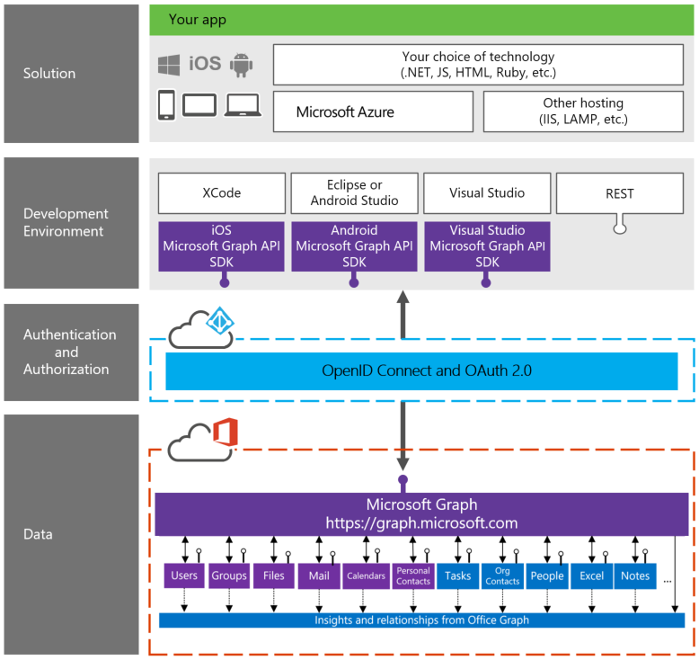

# Visão geral do Microsoft Graph

O Microsoft Graph (anteriormente chamado de API unificada do Office 365) expõe várias APIs dos serviços de nuvem da Microsoft por meio de um único ponto de extremidade da API REST (**https://graph.microsoft.com**). Usando o Microsoft Graph, você pode transformar consultas que eram difíceis ou complexas em navegação simples. 
 
O Microsoft Graph oferece a você:

- Um ponto de extremidade de API unificada para acessar dados agregados de vários serviços em nuvem da Microsoft em uma única resposta 
- Navegação direta entre entidades e as relações entre elas 
- Acesso a inteligência e ideias provenientes da nuvem da Microsoft

E tudo isso usando um token de autenticação único.

Você pode usar a API para acessar entidades fixas, como usuários, grupos, emails, mensagens, calendários, tarefas e anotações provenientes de serviços como o Outlook, o OneDrive, o Azure Active Directory, o Planner, o OneNote e outros. Você também pode obter relações calculadas da plataforma Office Graph (somente para usuários comerciais), como a lista de usuários com quem você está trabalhando ou os documentos mais populares à sua volta.

O Microsoft Graph expõe dois pontos de extremidade. Um ponto de extremidade com disponibilidade geral /v1.0 e um ponto de extremidade de visualização /beta.  Você pode usar /v1.0 em seus aplicativos de produção, mas não /beta.  O ponto de extremidade de visualização /beta é onde oferecemos os recursos mais recentes para que o desenvolvedor os experimente e forneça comentários. As APIs na versão beta podem mudar a qualquer momento e não estão prontas para uso de produção.

<!---->

##Consultas comuns

Aqui estão alguns exemplos de consultas comuns usando a API do Microsoft Graph:

| **Operação** | **Ponto de extremidade de serviço** |
|:--------------------------|:----------------------------------------|
|   GET meu perfil |    `https://graph.microsoft.com/v1.0/me` |
|   GET meus arquivos|   `https://graph.microsoft.com/v1.0/me/drive/root/children` |
|   GET minha foto     | `https://graph.microsoft.com/v1.0/me/photo/$value` |
|   GET meu email |   `https://graph.microsoft.com/v1.0/me/messages` |
|   GET meu email de alta prioridade | `https://graph.microsoft.com/v1.0/me/messages?$filter=importance%20eq%20'high'` |
|   GET meu calendário |   `https://graph.microsoft.com/v1.0/me/calendar` |
|   GET meu gerente  | `https://graph.microsoft.com/v1.0/me/manager` |
|   GET o último usuário que modificou o arquivo foo.txt |  `https://graph.microsoft.com/v1.0/me/drive/root/children/foo.txt/lastModifiedByUser` |
|   GET grupos unificados dos quais sou membro|   `https://graph.microsoft.com/v1.0/me/memberOf/$/microsoft.graph.group?$filter=groupTypes/any(a:a%20eq%20'unified')` |
|   GET os usuários em minha organização     | `https://graph.microsoft.com/v1.0/users` |
|   GET conversas em grupo |   `https://graph.microsoft.com/v1.0/groups/<id>/conversations` |
|   GET as pessoas relacionadas a mim    | `https://graph.microsoft.com/beta/me/people` |
|   GET arquivos mais populares à minha volta |  `https://graph.microsoft.com/beta/me/trendingAround` |
|   GET as pessoas com quem estou trabalhando     | `https://graph.microsoft.com/beta/me/workingWith` |
|   GET minhas tarefas    | `https://graph.microsoft.com/beta/me/tasks` |
|   GET minhas anotações |  `https://graph.microsoft.com/beta/me/notes/notebooks` |

<!--  -->

## Todos os dados do Office 365 no mesmo local

O diagrama a seguir mostra a pilha de desenvolvedor do Microsoft Graph e como ela funciona.

 >  Os seus comentários são importantes para nós. Junte-se a nós na página [Stack Overflow](http://stackoverflow.com/questions/tagged/office365+or+microsoftgraph). Marque as suas perguntas com [MicrosoftGraph] e [office365].

