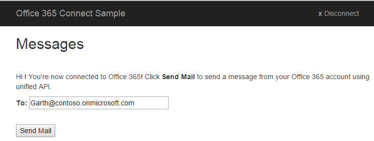

# Chamar o Microsoft Graph em um aplicativo do ASP.NET MVC

Neste artigo, analisamos as tarefas mínimas necessárias para conectar seu aplicativo ao Office 365 e chamar a API do Microsoft Graph. Este tópico não criará um aplicativo do zero. Usamos código do [exemplo do Office 365 Connect em ASP.NET MVC usando o Microsoft Graph](https://github.com/microsoftgraph/aspnet-connect-rest-sample) para explicar os principais conceitos que você precisa implementar em seu aplicativo.

A seguir temos uma captura de tela da página Enviar email.



## Visão geral

Para chamar a API do Microsoft Graph, você deve concluir as tarefas a seguir.

1. Registrar o aplicativo no Azure Active Directory
2. Autenticar um usuário e obter token de acesso chamando métodos na Biblioteca de autenticação do Azure AD para .NET. (ADAL)
3. Usar a ADAL para obter um token de acesso
4. Usar o token de acesso em uma solicitação para a API do Microsoft Graph
5. Desconectar sessão

<!--<a name="register"></a>-->
## Registrar o aplicativo no Azure Active Directory

Antes de começar a trabalhar com o Office 365, você precisa registrar seu aplicativo e definir permissões para usar os serviços do Microsoft Graph. Com apenas alguns cliques, você pode registrar seu aplicativo para acessar uma conta corporativa ou de estudante de um usuário usando a [Ferramenta de Registro de Aplicativo](https://dev.office.com/app-registration). 
Para gerenciá-la, você precisará acessar o [portal de Gerenciamento do Microsoft Azure](https://manage.windowsazure.com)

Confira [Registrar seu aplicativo Web baseado em navegador no Portal de Gerenciamento do Azure](https://msdn.microsoft.com/office/office365/HowTo/add-common-consent-manually#bk_RegisterWebApp) para obter instruções alternativas. Tenha em mente os detalhes a seguir.

* Não deixe de especificar http://localhost:55065/ como a **URL de Entrada**.
* Depois de registrar o aplicativo, [configure as **Permissões delegadas**](https://github.com/microsoftgraph/aspnet-connect-rest-sample/wiki/Grant-permissions-to-the-Connect-application-in-Azure) que seu aplicativo Angular exige. O exemplo do Connect exige a permissão **Enviar emails como usuário conectado**.

Anote os seguintes valores na página **Configurar** do seu aplicativo do Azure porque você precisará deles para configurar seu aplicativo.

* ID do cliente (exclusiva para seu aplicativo)
* Chave (também conhecida como segredo de cliente)
* Uma URL de resposta (também conhecida como URL de redirecionamento). Para este exemplo é http://localhost:55065/.

  > Observação:  o valor de URL de resposta é preenchido automaticamente com o valor da URL de entrada especificado quando você registrou o aplicativo.

<!--<a name="#auth"></a>-->
## Autenticação no exemplo do Connect

A ADAL (Biblioteca de autenticação do Azure AD) para .NET permite que os desenvolvedores de aplicativo cliente autentiquem usuários e obtenham tokens de acesso para fazer chamadas à API.  Você pode incluir essa biblioteca em seu projeto ASP.NET MVC usando **Gerenciar pacotes NuGet** no Visual Studio.

A seguir, temos uma captura de tela da página inicial.


O fluxo de autenticação pode ser dividido em duas etapas básicas:

1. Solicitar um código de autorização
2. Usar o código de autorização para solicitar um token de acesso.

>  **Observação**: além do token de acesso, você obtém um token de atualização. Você pode usar o token de atualização para adquirir um novo token de acesso quando o token de acesso atual expira.

O exemplo de conexão usa os valores de registro do aplicativo Azure e a ID de usuário para autenticar. O fluxo de autenticação da ADAL requer a ID do cliente, a chave e a URL de resposta (também conhecida como URL de redirecionamento) obtidas durante o processo de registro no Azure.

Para solicitar um código de autorização, primeiro redirecione o aplicativo para a URL de solicitação de autorização do Azure AD conforme mostrado abaixo (confira o arquivo HomeController.cs).


```c#
        public ActionResult Login()
        {
            if (string.IsNullOrEmpty(Settings.ClientId) || string.IsNullOrEmpty(Settings.ClientSecret))
            {
                ViewBag.Message = "Please set your client ID and client secret in the Web.config file";
                return View();
            }


            var authContext = new AuthenticationContext(Settings.AzureADAuthority);

            // Generate the parameterized URL for Azure login.
            Uri authUri = authContext.GetAuthorizationRequestURL(
                Settings.O365UnifiedAPIResource,
                Settings.ClientId,
                loginRedirectUri,
                UserIdentifier.AnyUser,
                null);

            // Redirect the browser to the login page, then come back to the Authorize method below.
            return Redirect(authUri.ToString());
        }

```
Quando esse método **Login** é chamado, o aplicativo redireciona o usuário a uma página de entrada. Isso leva o aplicativo para a página de entrada. Depois que as credenciais de usuário são autenticadas com êxito, o Azure redireciona o aplicativo para a URL de redirecionamento mencionada no código conforme indicado por *loginRedirectUri*. Essa URL de redirecionamento é uma URL para outra ação no aplicativo do ASP.NET MVC, conforme mostrado.

```c#

 Uri loginRedirectUri => new Uri(Url.Action(nameof(Authorize), "Home", null, Request.Url.Scheme));

```
A URL também conterá o código de autorização mencionado nas etapas 1 e 2 acima.  Ela obterá o código de autorização dos parâmetros de solicitação. Usando o código de autorização, o aplicativo chamará o Azure AD para obter o token de acesso. Quando recebermos o token de acesso, poderemos armazená-lo na sessão para usá-lo em várias solicitações.

A ação Autorizar mencionada na ação URL de redirecionamento tem esta aparência.

```c#
        public async Task<ActionResult> Authorize()
        {
            var authContext = new AuthenticationContext(Settings.AzureADAuthority);


            // Get the token.
            var authResult = await authContext.AcquireTokenByAuthorizationCodeAsync(
                Request.Params["code"],                                         // the auth 'code' parameter from the Azure redirect.
                loginRedirectUri,                                               // same redirectUri as used before in Login method.
                new ClientCredential(Settings.ClientId, Settings.ClientSecret), // use the client ID and secret to establish app identity.
                Settings.O365UnifiedAPIResource);

            // Save the token in the session.
            Session[SessionKeys.Login.AccessToken] = authResult.AccessToken;

            // Get info about the current logged in user.
            Session[SessionKeys.Login.UserInfo] = await UnifiedApiHelper.GetUserInfoAsync(authResult.AccessToken);

            return RedirectToAction(nameof(Index), "Message");

        }

```
>  **Observação**:  Para obter mais informações sobre fluxo de autorização, confira [Fluxo de Concessão de Código de Autorização] (https://msdn.microsoft.com/pt-BR/library/azure/dn645542.aspx)

<!--<a name="request"></a>-->
## Usar o token de acesso em uma solicitação para a API do Microsoft Graph

Depois que o usuário entra, o exemplo do Connect mostra ao usuário uma atividade de envio de mensagem de email.  Com um token de acesso, o aplicativo pode fazer solicitações autenticadas à API do Microsoft Graph.

Por exemplo, o arquivo UnifiedApiHelper.cs contém o código que:

1)  Obtenha informações sobre o usuário conectado no momento.  O método ``GetUserInfoAsync`` usa um argumento único (valor do token de acesso) para chamar o **https://graph.microsoft.com/v1.0/me** para obter informações sobre o usuário conectado no momento.

 ```c#

        public static async Task<UserInfo> GetUserInfoAsync(string accessToken)
        {
            UserInfo myInfo = new UserInfo();

            using (var client = new HttpClient())
            {
                using (var request = new HttpRequestMessage(HttpMethod.Get, Settings.GetMeUrl))
                {
                    request.Headers.Accept.Add(Json);
                    request.Headers.Authorization = new AuthenticationHeaderValue("Bearer", accessToken);

                    using (var response = await client.SendAsync(request))
                    {
                        if (response.StatusCode == HttpStatusCode.OK)
                        {
                            var json = JObject.Parse(await response.Content.ReadAsStringAsync());
                            myInfo.Name = json?["displayName"]?.ToString();
                            myInfo.Address = json?["mail"]?.ToString().Trim().Replace(" ", string.Empty);

                        }
                    }
                }
            }

            return myInfo;
        }

```


2)  Criar e enviar a mensagem que o usuário conectado deseja enviar por email. O método ``SendMessageAsync`` cria e envia uma solicitação POST para a URL de recursos **https://graph.microsoft.com/v1.0/me/microsoft.graph.sendmail**, usando o valor de token de acesso como um dos argumentos.


```c#

        public static async Task<SendMessageResponse> SendMessageAsync(string accessToken, SendMessageRequest sendMessageRequest)
        {
            var sendMessageResponse = new SendMessageResponse { Status = SendMessageStatusEnum.NotSent };

            using (var client = new HttpClient())
            {
                using (var request = new HttpRequestMessage(HttpMethod.Post, Settings.SendMessageUrl))
                {
                    request.Headers.Authorization = new AuthenticationHeaderValue("Bearer", accessToken);
                    request.Content = new StringContent(JsonConvert.SerializeObject(sendMessageRequest), Encoding.UTF8, "application/json");
                    using (HttpResponseMessage response = await client.SendAsync(request))
                    {
                        if (response.IsSuccessStatusCode)
                        {
                            sendMessageResponse.Status = SendMessageStatusEnum.Sent;
                            sendMessageResponse.StatusMessage = null;
                        }
                        else
                        {
                            sendMessageResponse.Status = SendMessageStatusEnum.Fail;
                            sendMessageResponse.StatusMessage = response.ReasonPhrase;
                        }
                    }
                }
            }

            return sendMessageResponse;
        }

```


O arquivo ``MessageController.cs `` contém um código que gerencia mensagens de email. Por exemplo, o botão **Enviar email**. O método  ``SendMessageSubmit `` envia a mensagem quando os usuários clicam no botão **Enviar email**.


```c#

        public async Task<ActionResult> SendMessageSubmit(UserInfo userInfo)
        {
            // After Index method renders the View, user clicks Send Mail, which comes in here.
            EnsureUser(ref userInfo);

            // Send email using O365 unified API.
            var sendMessageResult = await UnifiedApiHelper.SendMessageAsync(
                (string)Session[SessionKeys.Login.AccessToken],
                GenerateEmail(userInfo));

            // Reuse the Index view for messages (sent, not sent, fail) .
            // Redirect to tell the browser to call the app back via the Index method.
            return RedirectToAction(nameof(Index), new RouteValueDictionary(new Dictionary<string,object>{
                { "Status", sendMessageResult.Status },
                { "StatusMessage", sendMessageResult.StatusMessage },
                { "Address", userInfo.Address },
            }));
        }

```


O método ``CreateEmailObject`` cria o objeto de email no contrato de formato/dados necessários da solicitação que o corpo POST exige:


  ```c#

        private SendMessageRequest CreateEmailObject(UserInfo to, string subject, string body)
        {
            return new SendMessageRequest
            {
                Message = new Message
                {
                    Subject = subject,
                    Body = new MessageBody
                    {
                        ContentType = "Html",
                        Content = body
                    },
                    ToRecipients = new List<Recipient>
                    {
                        new Recipient
                        {
                            EmailAddress = new UserInfo
                            {
                                 Name =  to.Name,
                                 Address = to.Address
                            }
                        }
                    }
                },
                SaveToSentItems = true
            };

```

Outra tarefa é criar uma cadeia de caracteres de mensagem JSON válida e enviá-la para o ponto de extremidade ``https://graph.microsoft.com/v1.0/me/microsoft.graph.sendmail`` usando uma solicitação HTTP POST. Como o corpo do email é enviado como um documento HTML, a solicitação define o valor ``ContentType`` da mensagem de email como HTML e codifica o conteúdo como JSON para a solicitação HTTP POST. O arquivo UnifiedApiMessageModels.cs contém os contratos de esquema ou de dados entre o aplicativo e o servidor da API unificada do Office 365.


```c#


    public class SendMessageResponse
    {
        public SendMessageStatusEnum Status { get; set; }
        public string StatusMessage { get; set; }
    }

    public class SendMessageRequest
    {
        public Message Message { get; set; }

        public bool SaveToSentItems { get; set; }
    }

    public class Message
    {
        public string Subject { get; set; }
        public MessageBody Body { get; set; }
        public List<Recipient> ToRecipients { get; set; }
    }
    public class Recipient
    {
        public UserInfo EmailAddress { get; set; }
    }

    public class MessageBody
    {
        public string ContentType { get; set; }
        public string Content { get; set; }
    }

    public class UserInfo
    {
        public string Name { get; set; }
        public string Address { get; set; }
    }

}

```
<!--<a name="logout"></a>-->
## Desconectar a sessão

Quando o usuário clica em **Desconectar** na página Enviar email, ele é desconectado da sessão. O código faz isso ao
* desmarcar a sessão local
* redirecionar o navegador para o ponto de extremidade de saída (para que o Azure possa desmarcar seus próprios cookies)

O método **Logout** (confira o arquivo HomeController.cs) mostra como fazer isso.


```c#
        public ActionResult Logout()
        {
            Session.Clear();
            return Redirect(Settings.LogoutAuthority + logoutRedirectUri.ToString());
        }

```

##Próximas etapas
A API do Microsoft Graph é uma API unificadora muito poderosa que pode ser usada para interagir com todos os tipos de dados da Microsoft. Confira a referência de API para explorar o que mais você pode fazer com a API do Microsoft Graph. 
Explore nossos outros exemplos do ASP.NET no [GitHub](http://aka.ms/aspnetgraphsamples).


