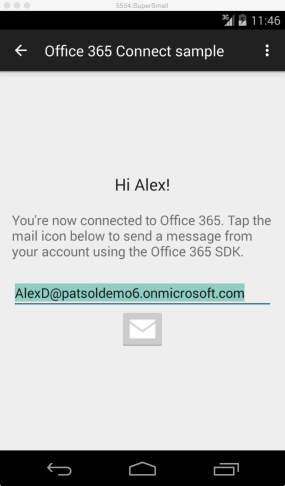

# Chamar o Microsoft Graph em um aplicativo do Android

Neste artigo, analisamos as tarefas mínimas necessárias para se obter um token de acesso do Azure AD (Azure Active Directory) e chamar o Microsoft Graph. Usamos código do [exemplo do Office 365 Connect para Android usando o Microsoft Graph](https://github.com/microsoftgraph/android-java-connect-rest-sample) para explicar os principais conceitos que você precisa implementar em seu aplicativo.

A imagem a seguir mostra a atividade de envio de email do aplicativo de exemplo que aparece depois de um usuário se conectar ao Office 365.



## Visão geral

Para chamar a API do Microsoft Graph, o [exemplo do Office 365 Connect para Android](https://github.com/microsoftgraph/android-java-connect-rest-sample) conclui as tarefas a seguir.

1. Autenticar um usuário e obter acesso a um token chamando métodos na biblioteca do Azure Active Directory.
2. Criar uma solicitação de mensagem de email como uma operação REST no ponto de extremidade API do Microsoft Graph.

<!--<a name="register"/>-->
## Registrar o aplicativo no Azure Active Directory

Antes de começar a trabalhar com o Office 365, você precisa registrar seu aplicativo e definir permissões para usar os serviços do Microsoft Graph. Com apenas alguns cliques, você pode registrar seu aplicativo para acessar uma conta corporativa ou de estudante de um usuário usando a [Ferramenta de Registro de Aplicativo](https://dev.office.com/app-registration). 
Para gerenciá-la, você precisará acessar o [portal de Gerenciamento do Microsoft Azure](https://manage.windowsazure.com)

Como alternativa, confira a seção **Registrar seu aplicativo nativo no Portal de gerenciamento do Azure** no artigo [Registrar manualmente seu aplicativo no Azure AD para que ele possa acessar as APIs do Office 365](https://msdn.microsoft.com/en-us/office/office365/howto/add-common-consent-manually) a fim de obter instruções sobre como registrar manualmente o aplicativo. Tenha em mente os seguintes detalhes:

* Configure as **Permissões delegadas** que seu aplicativo exige. O exemplo do Connect exige uma permissão **Enviar emails como usuário conectado**.

Anote os valores a seguir na página **Configurar** do seu aplicativo Azure.

* ID do cliente
* Uma URL de redirecionamento

Você precisa desses valores para configurar o código de autenticação em seu aplicativo.

## Dependências Gradle no exemplo do Connect
O exemplo assume dependências entre as bibliotecas mostradas no seguinte trecho build.gradle

```gradle
dependencies {
    compile fileTree(dir: 'libs', include: ['*.jar'])
    compile 'com.android.support:appcompat-v7:22.1.1'

    // Azure Active Directory Library
    compile 'com.microsoft.aad:adal:1.1.7'

    // Retrofit + custom HTTP
    compile 'com.squareup.okhttp:okhttp-urlconnection:2.0.0'
    compile 'com.squareup.okhttp:okhttp:2.0.0'
    compile 'com.squareup.retrofit:retrofit:1.9.0'
}

```
<!--<a name="authenticate"/>-->
## Autenticação no exemplo do Connect
O exemplo de conexão usa os valores de registro do aplicativo Azure e a ID de usuário para autenticar. Há dois comportamentos de autenticação com suporte do exemplo de conexão.

* Autenticação solicitada. Usada quando uma ID de usuário não é armazenada em cache nas preferências do dispositivo Android
* Autenticação silenciosa. Usada quando uma ID de usuário é armazenada em cache e não é solicitada.

A classe [AuthenticationManager.java](https://github.com/microsoftgraph/android-java-connect-rest-sample/blob/master/app/src/main/java/com/microsoft/office365/connectmicrosoftgraph/AuthenticationManager.java) fornece um método auxiliar `isConnected()` para encontrar qualquer ID de usuário armazenada em cache e determinar o comportamento de autenticação a usar.


```java
    private boolean isConnected(){
        SharedPreferences settings = this
                .mContextActivity
                .getSharedPreferences(PREFERENCES_FILENAME, Context.MODE_PRIVATE);

        return settings.contains(USER_ID_VAR_NAME);
    }

```

Seja qual for o comportamento, o fluxo de autenticação ADAL precisa da ID do cliente e da URL de redirecionamento obtida no processo de registro no Azure. O exemplo mantém essas cadeias de caracteres no código-fonte e as recupera antes do objeto do gerenciador de autenticação autenticar o usuário.

A interface [Constants.java](https://github.com/microsoftgraph/android-java-connect-rest-sample/blob/master/app/src/main/java/com/microsoft/office365/connectmicrosoftgraph/Constants.java) expõe duas cadeias de caracteres estáticas para ID do cliente e URL de redirecionamento.

```java
interface Constants {
    String AUTHORITY_URL = "https://login.microsoftonline.com/common";
    // Update these two constants with the values for your application:
    String CLIENT_ID = "<Your client id here>";
    String REDIRECT_URI = "<Your redirect uri here>";
    String UNIFIED_API_ENDPOINT = "https://graph.microsoft.com/v1.0/";
    String UNIFIED_ENDPOINT_RESOURCE_ID = "https://graph.microsoft.com/";
}
```
### Construir a classe AuthenticationManager
O construtor [AuthenticationManager.java](https://github.com/microsoftgraph/android-java-connect-rest-sample/blob/master/app/src/main/java/com/microsoft/office365/connectmicrosoftgraph/AuthenticationManager.java) não requer argumentos, mas define um campo de cadeia de caracteres de classe do arquivo Constants.java com a URL do ponto de extremidade do Graph. Essa cadeia de caracteres do recurso é usada para ambos os comportamentos de autenticação.

```java
    private AuthenticationManager() {
        mResourceId = Constants.UNIFIED_ENDPOINT_RESOURCE_ID;
    }
```

### Autenticação solicitada

A classe [AuthenticationManager.java](https://github.com/microsoftgraph/android-java-connect-rest-sample/blob/master/app/src/main/java/com/microsoft/office365/connectmicrosoftgraph/AuthenticationManager.java) fornece um método `authenticatePrompt()` para adquirir o token de acesso usado para chamadas REST no ponto de extremidade unificado.

O método `acquireToken()` da biblioteca ADAL é assíncrono. Os argumentos de método incluem uma referência ao contexto da atividade atual junto com o recurso, a ID do cliente e a URL de redirecionamento. A referência de atividade atual permite que a biblioteca ADAL exiba uma página de desafio de credencial na atividade. 
Se a autenticação for bem-sucedida, a biblioteca ADAL invoca o retorno de chamada `onSuccess()`. Esse retorno de chamada faz duas coisas:

* Armazena o token de acesso em `mAccessToken`. Quando você faz com que uma chamada REST envie uma mensagem de email, o exemplo coloca esse token de acesso em um cabeçalho de autorização.
* Armazena a ID do usuário nas preferências armazenadas.


```java
    /**
     * Calls acquireToken to prompt the user for credentials.
     *
     * @param authenticationCallback The callback to notify when the processing is finished.
     */
    private void authenticatePrompt(final AuthenticationCallback<AuthenticationResult> authenticationCallback) {
        getAuthenticationContext().acquireToken(
                this.mContextActivity,
                this.mResourceId,
                Constants.CLIENT_ID,
                Constants.REDIRECT_URI,
                PromptBehavior.Always,
                new AuthenticationCallback<AuthenticationResult>() {
                    @Override
                    public void onSuccess(final AuthenticationResult authenticationResult) {
                        if (authenticationResult != null) {
                            if (authenticationResult.getStatus() == AuthenticationStatus.Succeeded) {
                                setUserId(authenticationResult.getUserInfo().getUserId());
                                mAccessToken = authenticationResult.getAccessToken();
                                authenticationCallback.onSuccess(authenticationResult);
                            } else {
                                // We need to make sure that there is no data stored with the failed auth
                                AuthenticationManager.getInstance().disconnect();
                                // This condition can happen if user signs in with an MSA account
                                // instead of an Office 365 account
                                authenticationCallback.onError(
                                        new AuthenticationException(
                                                ADALError.AUTH_FAILED,
                                                authenticationResult.getErrorDescription()));
                            }
                        } else {
                            // I could not authenticate the user silently,
                            // falling back to prompt the user for credentials.
                            authenticatePrompt(authenticationCallback);
                        }
                    }

                    @Override
                    public void onError(Exception e) {
                        // We need to make sure that there is no data stored with the failed auth
                        AuthenticationManager.getInstance().disconnect();
                        authenticationCallback.onError(e);
                    }
                }
        );
    }

```

###Autenticação silenciosa
A classe [AuthenticationManager.java](https://github.com/microsoftgraph/android-java-connect-rest-sample/blob/master/app/src/main/java/com/microsoft/office365/connectmicrosoftgraph/AuthenticationManager.java) fornece um método `authenticateSilent()` para adquirir o token de acesso usado em chamadas REST no ponto de extremidade unificado.

O método `acquireTokenSilent()` da biblioteca ADAL é assíncrono. Além da ID do cliente de registro no Azure e da ID de recurso, ela assume a ID do usuário armazenada nas preferências compartilhadas. 
O método auxiliar `getUserId()` recebe a ID do Usuário do armazenamento.

Se a autenticação for bem-sucedida, o método `onSuccess()` será invocado. `onSuccess` armazena o token de acesso em `mAccessToken`. Quando você faz com que uma chamada REST envie uma mensagem de email, o exemplo coloca esse token de acesso em um cabeçalho de autorização.
```java
    /**
     * Calls acquireTokenSilent with the user id stored in shared preferences.
     * In case of an error, it falls back to {@link AuthenticationManager#authenticatePrompt(AuthenticationCallback)}.
     *
     * @param authenticationCallback The callback to notify when the processing is finished.
     */
    private void authenticateSilent(final AuthenticationCallback<AuthenticationResult> authenticationCallback) {
        getAuthenticationContext().acquireTokenSilent(
                this.mResourceId,
                Constants.CLIENT_ID,
                getUserId(),
                new AuthenticationCallback<AuthenticationResult>() {
                    @Override
                    public void onSuccess(final AuthenticationResult authenticationResult) {
                        if (authenticationResult != null) {
                            if (authenticationResult.getStatus() == AuthenticationStatus.Succeeded) {
                                mAccessToken = authenticationResult.getAccessToken();
                                authenticationCallback.onSuccess(authenticationResult);
                            } else {
                                authenticationCallback.onError(
                                        new Exception(authenticationResult.getErrorDescription()));

                            }
                        } else {
                            // I could not authenticate the user silently,
                            // falling back to prompt the user for credentials.
                            authenticatePrompt(authenticationCallback);
                        }
                    }

                    @Override
                    public void onError(Exception e) {
                        // I could not authenticate the user silently,
                        // falling back to prompt the user for credentials.
                        authenticatePrompt(authenticationCallback);
                    }
                }
        );
    }

```
<!--<a name="sendmail"/>-->
## Enviar uma mensagem de email usando o Office 365

Depois que o usuário entra no Azure, o exemplo do Connect mostra ao usuário uma atividade de envio de mensagem de email. O exemplo do Connect usa a classe [MSGraphAPIController.java](https://github.com/microsoftgraph/android-java-connect-rest-sample/blob/master/app/src/main/java/com/microsoft/office365/connectmicrosoftgraph/MSGraphAPIController.java) para enviar a mensagem quando os usuários clicam no botão Enviar email.

### classe auxiliar do adaptador REST
A classe [RESTHelper.java](https://github.com/microsoftgraph/android-java-connect-rest-sample/blob/master/app/src/main/java/com/microsoft/office365/connectmicrosoftgraph/RESTHelper.java) fornece um método para inserir um cabeçalho de autorização em cada chamada REST realizada pelo exemplo. Ela usa o token de acesso fornecido pelo gerente de autenticação.

```java
       //This method catches outgoing REST calls and injects the Authorization and host headers before
        //sending to REST endpoint
        RequestInterceptor requestInterceptor = new RequestInterceptor() {
            @Override
            public void intercept(RequestFacade request) {
                final String token = mAccessToken;
                if (null != token) {
                    request.addHeader("Authorization", "Bearer " + token);
                }
            }
        };
```
### Classe UnifiedAPIController
A classe [MSGraphAPIController.java](https://github.com/microsoftgraph/android-java-connect-rest-sample/blob/master/app/src/main/java/com/microsoft/office365/connectmicrosoftgraph/MSGraphAPIController.java) gera a solicitação REST no método `sendMail()`.


```java
    /**
     * Sends an email message using the Unified API on Office 365. The mail is sent
     * from the address of the signed in user.
     *
     * @param emailAddress The recipient email address.
     * @param subject      The subject to use in the mail message.
     * @param body         The body of the message.
     * @param callback     UI callback to be invoked by Retrofit call when
     *                     operation completed
     */
    public void sendMail(
            final String emailAddress,
            final String subject,
            final String body,
            Callback<Void> callback) {
        ensureService();
        // Use the Unified API service on Office 365 to create the message.
        mUnifiedAPIService.sendMail(
                "application/json",
                createMailPayload(
                        subject,
                        body,
                        emailAddress),
                callback);
    }

```
### A interface UnifiedAPIService
A interface [MSGraphAPIController.java](https://github.com/microsoftgraph/android-java-connect-rest-sample/blob/master/app/src/main/java/com/microsoft/office365/connectmicrosoftgraph/MSGraphAPIController.java) fornece assinaturas de método para as chamadas REST realizadas pelo exemplo usando anotações Retrofit.

```java
    @POST("/me/sendMail")
    void sendMail(
            @Header("Content-type") String contentTypeHeader,
            @Body TypedString mail,
            Callback<Void> callback);


```

## Próximas etapas
A API do Microsoft Graph é uma API unificadora muito poderosa que pode ser usada para interagir com todos os tipos de dados da Microsoft. Confira a [Documentação do Microsoft Graph](http://graph.microsoft.io/docs) para explorar o que mais você pode fazer com a API do Microsoft Graph.

Já publicamos muitos exemplos do Android para o Office 365. Cada um desses exemplos se baseia nos conceitos que apresentamos no exemplo do Connect. Se quiser fazer mais com seus aplicativos Android, confira [mais de nossos exemplos do Android para o Office 365](http://aka.ms/androidgraphsamples) na organização GitHub do Office.
 
