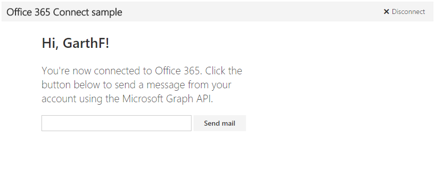

# Chamar o Microsoft Graph em um aplicativo Angular 

Neste artigo, analisamos as tarefas mínimas necessárias para conectar seu aplicativo ao Office 365 e chamar a API do Microsoft Graph. Usamos código do [exemplo do Office 365 Angular Connect usando o Microsoft Graph](https://github.com/microsoftgraph/angular-connect-rest-sample) para explicar os principais conceitos que você precisa implementar no seu aplicativo.



## Pré-requisitos  

Este tópico pressupõe o seguinte.

* Você lê código em JavaScript e [AngularJS](https://angularjs.org/) com facilidade.

## Visão geral

Para chamar a API do Microsoft Graph, você deve concluir as tarefas a seguir.

1. Registrar o aplicativo no Azure Active Directory
2. Configurar a ADAL JS (Biblioteca do Azure Active Directory para JavaScript)
3. Usar a ADAL JS para obter um token de acesso
4. Usar o token de acesso em uma solicitação para a API do Microsoft Graph

<!--<a name="register"></a>-->
## Registrar o aplicativo no Azure Active Directory

Antes de começar a trabalhar com o Office 365, você precisa registrar seu aplicativo e definir permissões para usar os serviços do Microsoft Graph. Com apenas alguns cliques, você pode registrar seu aplicativo para acessar uma conta corporativa ou de estudante de um usuário usando a [Ferramenta de Registro de Aplicativo](https://dev.office.com/app-registration). 
Para gerenciá-la, você precisará acessar o [portal de Gerenciamento do Microsoft Azure](https://manage.windowsazure.com)

Como alternativa, confira o artigo [Registrar seu aplicativo Web baseado em navegador no Portal de Gerenciamento do Azure](https://msdn.microsoft.com/en-us/office/office365/HowTo/add-common-consent-manually#bk_RegisterWebApp) para obter instruções sobre como registrar manualmente o aplicativo. Lembre-se dos seguintes detalhes:

* Não deixe de especificar http://127.0.0.1:8080/ como a **URL de Logon**.
* Depois de registrar o aplicativo, [configure as **Permissões delegadas**](https://github.com/microsoftgraph/angular-connect-rest-sample/wiki/Grant-permissions-to-the-Connect-application-in-Azure) que seu aplicativo Angular exige. O exemplo do Connect exige a permissão **Enviar emails como usuário conectado**.

Anote os seguintes valores na página **Configurar** do seu aplicativo do Azure porque você precisará deles para configurar a [ADAL JS](https://github.com/AzureAD/azure-activedirectory-library-for-js) no seu aplicativo Angular.

* ID do cliente (exclusiva para seu aplicativo)
* Uma URL de resposta (http://127.0.0.1:8080/)

<!--<a name="adal"></a>-->
## Configurar a ADAL JS (Biblioteca do Azure Active Directory para JavaScript)

A [ADAL JS](https://github.com/AzureAD/azure-activedirectory-library-for-js) é uma biblioteca de JavaScript que dá suporte completo à entrada de usuários do Azure AD em SPAs (aplicativos de página única), como o exemplo do Connect e o gerenciamento de token, além de outros recursos. Para aproveitar essa biblioteca, seu aplicativo Angular tem que incluí-la e configurá-la.

Simplesmente inclua a biblioteca e seu módulo específico para Angular usando a CDN da Microsoft.

```html
<script src="https://secure.aadcdn.microsoftonline-p.com/lib/1.0.7/js/adal.min.js"></script>
<script src="https://secure.aadcdn.microsoftonline-p.com/lib/1.0.7/js/adal-angular.min.js"></script>
```

Em seguida, você precisa configurar o serviço ADAL JS onde quer que configure as dependências do seu aplicativo Angular. O exemplo do Connect faz sua configuração em [*public/app.js*](https://github.com/microsoftgraph/angular-connect-rest-sample/blob/master/public/scripts/app.js). 

Para configurar a ADAL JS, primeiro inclua uma referência ao módulo ADAL, adicionando ```AdalAngular``` à matriz do módulo e passando ```adalAuthenticationServiceProvider``` para a função ```config```. Configure a biblioteca com a função ```init```, passando para ela a ID do cliente do aplicativo e um objeto ```endpoints``` que declara para qual API seu aplicativo Angular precisa fazer solicitações CORS.

```javascript
// Initialize the ADAL provider with your clientID (found in the Azure Management Portal) and 
// the API URL (to enable CORS requests).
adalAuthenticationServiceProvider.init(
  {
    clientId: clientId,
    // The endpoints here are resources for cross origin requests.
    endpoints: {
      'https://graph.microsoft.com': 'https://graph.microsoft.com'
    }
  },
  $httpProvider
);
```

<!--<a name="accessToken"></a>-->
## Usar a ADAL JS para obter um token de acesso

Seu aplicativo precisa redirecionar o navegador para uma página de entrada, para que o usuário possa entrar e conceder a seu aplicativo o acesso aos dados. O exemplo do Connect usa a ADAL JS para lidar com essa tarefa. 

Em um dos controladores do seu aplicativo, primeiro adicione uma referência ao serviço ADAL, injetando ```adalAuthenticationService``` em seu controlador, e defina uma função que use a função ```login``` do serviço e que possa ser chamada pela sua interface do usuário. O exemplo do Connect faz isso no arquivo [*controllers/mainController.js*](https://github.com/microsoftgraph/angular-connect-rest-sample/blob/master/public/controllers/mainController.js). 

```javascript
/**
  * Expose the login method from ADAL to the view.
  */
function connect() {
  adalAuthenticationService.login();
};
```

Quando essa função é chamada, o aplicativo redireciona o usuário para uma página de entrada. Depois de entrar e autorizar seu aplicativo, eles serão levados de volta ao aplicativo com o token de acesso na cadeia de caracteres de consulta que a ADAL JS recuperará e armazenará. 

<!--<a name="request"></a>-->
## Usar o token de acesso em uma solicitação para a API do Microsoft Graph

Com um token de acesso, o aplicativo pode fazer solicitações autenticadas à API do Microsoft Graph. A ADAL JS intercepta automaticamente todas as solicitações HTTP e adiciona seu token de acesso a elas para que você não precise definir manualmente o cabeçalho ao usar a biblioteca. 

O exemplo do Connect envia um email usando o ponto de extremidade ```me/sendMail``` na API do Microsoft Graph no arquivo [*controllers/mainController.js*](https://github.com/microsoftgraph/angular-connect-rest-sample/blob/master/public/controllers/mainController.js). 

O Microsoft Graph é uma API unificadora muito poderosa que pode ser usada para interagir com todos os tipos de dados da Microsoft. Confira a [referência de API](http://graph.microsoft.io/docs/api-reference/v1.0) para explorar o que mais você pode fazer com a API do Microsoft Graph.

