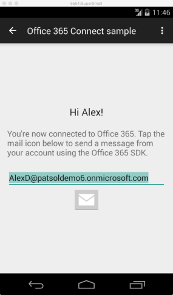

# 在 Android 应用中调用 Microsoft Graph

在本文中，我们将了解从 Azure Active Directory (AD) 中获取访问令牌，以及调用 Microsoft Graph 至少需要完成的任务。我们使用 [Office 365 Android 连接示例（使用 Microsoft Graph）](https://github.com/microsoftgraph/android-java-connect-rest-sample)中的代码，说明需要在您的应用中实现的主要概念。

以下图像展示了用户在连接到 Office 365 后看到的示例应用发送邮件活动。



## 概述

为了调用 Microsoft Graph API，[Office 365 Android Connect 示例](https://github.com/microsoftgraph/android-java-connect-rest-sample)会完成以下任务。

1. 对用户进行身份验证，然后通过在 Azure Active Directory Library 上调用方法来获取访问令牌。
2. 创建邮件请求作为 Microsoft Graph API 终结点上的 REST 操作。

<!--<a name="register"/>-->
## 在 Azure Active Directory 中注册应用程序

您需要先注册应用程序并设置 Microsoft Graph 服务的使用权限，然后才能开始使用 Office 365。只需单击几下，即可使用[应用程序注册工具](https://dev.office.com/app-registration)将应用程序注册为访问用户的工作或学校帐户。
若要进行管理，您需要转到 [Microsoft Azure 管理门户](https://manage.windowsazure.com)

您也可以参阅**在 Azure AD 中手动注册应用以便其能访问 Office 365 API** 一文中的[在 Azure 管理门户中注册本机应用](https://msdn.microsoft.com/en-us/office/office365/howto/add-common-consent-manually)部分，了解关于如何手动注册应用的说明，并注意以下细节：

* 配置应用需要的**委托的权限**。连接示例需要获得**以登录用户身份发送邮件**的权限。

请记下 Azure 应用程序的“**配置**”页中的下列值。

* 客户端 ID
* 重定向 URL

您需要这些值配置应用中的身份验证代码。

## 连接示例中的 Gradle 依存关系
此示例采用以下 build.gradle 代码段中显示的库依赖项

```gradle
dependencies {
    compile fileTree(dir: 'libs', include: ['*.jar'])
    compile 'com.android.support:appcompat-v7:22.1.1'

    // Azure Active Directory Library
    compile 'com.microsoft.aad:adal:1.1.7'

    // Retrofit + custom HTTP
    compile 'com.squareup.okhttp:okhttp-urlconnection:2.0.0'
    compile 'com.squareup.okhttp:okhttp:2.0.0'
    compile 'com.squareup.retrofit:retrofit:1.9.0'
}

```
<!--<a name="authenticate"/>-->
## 连接示例中的身份验证
连接示例使用 Azure 应用注册值和用户的 ID 进行身份验证。连接示例支持两种身份验证行为。

* 有提示的身份验证：在用户 ID 没有在 Android 设备上的存储首选项中缓存时使用。
* 无提示的身份验证：在用户 ID 已缓存且提示没有必要时使用。

[AuthenticationManager.java](https://github.com/microsoftgraph/android-java-connect-rest-sample/blob/master/app/src/main/java/com/microsoft/office365/connectmicrosoftgraph/AuthenticationManager.java) 类提供 `isConnected()` 帮助程序方法来查找任意已缓存的用户 ID，并确定要使用的身份验证行为。


```java
    private boolean isConnected(){
        SharedPreferences settings = this
                .mContextActivity
                .getSharedPreferences(PREFERENCES_FILENAME, Context.MODE_PRIVATE);

        return settings.contains(USER_ID_VAR_NAME);
    }

```

对于两种行为，ADAL 身份验证流均需要使用您在 Azure 注册过程中获得的客户端 ID 和重定向 URL。示例在源代码中保留这些字符串，并在身份验证管理器对象对用户进行身份验证之前检索这些字符串。

[Constants.java](https://github.com/microsoftgraph/android-java-connect-rest-sample/blob/master/app/src/main/java/com/microsoft/office365/connectmicrosoftgraph/Constants.java) 接口公开了客户端 ID 和重定向 URL 的两个静态字符串。

```java
interface Constants {
    String AUTHORITY_URL = "https://login.microsoftonline.com/common";
    // Update these two constants with the values for your application:
    String CLIENT_ID = "<Your client id here>";
    String REDIRECT_URI = "<Your redirect uri here>";
    String UNIFIED_API_ENDPOINT = "https://graph.microsoft.com/v1.0/";
    String UNIFIED_ENDPOINT_RESOURCE_ID = "https://graph.microsoft.com/";
}
```
### 构造 AuthenticationManager 类
虽然 [AuthenticationManager.java](https://github.com/microsoftgraph/android-java-connect-rest-sample/blob/master/app/src/main/java/com/microsoft/office365/connectmicrosoftgraph/AuthenticationManager.java) 的构造函数没有提取自变量，但会使用 Graph 终结点 URL 通过 Constants.java 文件设置类字符串字段。此资源字符串适用于两种身份验证行为。

```java
    private AuthenticationManager() {
        mResourceId = Constants.UNIFIED_ENDPOINT_RESOURCE_ID;
    }
```

### 有提示的身份验证

[AuthenticationManager.java](https://github.com/microsoftgraph/android-java-connect-rest-sample/blob/master/app/src/main/java/com/microsoft/office365/connectmicrosoftgraph/AuthenticationManager.java) 类提供 `authenticatePrompt()` 方法来获取适用于统一终结点上的 REST 调用的访问令牌。

ADAL 库 `acquireToken()` 是异步方法。方法自变量包括对当前活动上下文的引用、资源、客户端 ID 和重定向 URL。
借助当前活动引用，ADAL 库在活动中显示凭据质询页。如果身份验证成功，则 ADAL 库会调用 `onSuccess()` 回叫。此回叫完成以下两项操作：

* 将访问令牌存储在 `mAccessToken` 中。在执行 REST 调用以发送邮件时，示例将此访问令牌置于授权标头中。
* 将用户 ID 存储在存储首选项中。


```java
    /**
     * Calls acquireToken to prompt the user for credentials.
     *
     * @param authenticationCallback The callback to notify when the processing is finished.
     */
    private void authenticatePrompt(final AuthenticationCallback<AuthenticationResult> authenticationCallback) {
        getAuthenticationContext().acquireToken(
                this.mContextActivity,
                this.mResourceId,
                Constants.CLIENT_ID,
                Constants.REDIRECT_URI,
                PromptBehavior.Always,
                new AuthenticationCallback<AuthenticationResult>() {
                    @Override
                    public void onSuccess(final AuthenticationResult authenticationResult) {
                        if (authenticationResult != null) {
                            if (authenticationResult.getStatus() == AuthenticationStatus.Succeeded) {
                                setUserId(authenticationResult.getUserInfo().getUserId());
                                mAccessToken = authenticationResult.getAccessToken();
                                authenticationCallback.onSuccess(authenticationResult);
                            } else {
                                // We need to make sure that there is no data stored with the failed auth
                                AuthenticationManager.getInstance().disconnect();
                                // This condition can happen if user signs in with an MSA account
                                // instead of an Office 365 account
                                authenticationCallback.onError(
                                        new AuthenticationException(
                                                ADALError.AUTH_FAILED,
                                                authenticationResult.getErrorDescription()));
                            }
                        } else {
                            // I could not authenticate the user silently,
                            // falling back to prompt the user for credentials.
                            authenticatePrompt(authenticationCallback);
                        }
                    }

                    @Override
                    public void onError(Exception e) {
                        // We need to make sure that there is no data stored with the failed auth
                        AuthenticationManager.getInstance().disconnect();
                        authenticationCallback.onError(e);
                    }
                }
        );
    }

```

###无提示的身份验证
[AuthenticationManager.java](https://github.com/microsoftgraph/android-java-connect-rest-sample/blob/master/app/src/main/java/com/microsoft/office365/connectmicrosoftgraph/AuthenticationManager.java) 类提供 `authenticateSilent()` 方法来获取适用于统一终结点上的 REST 调用的访问令牌。

ADAL 库 `acquireTokenSilent()` 是异步方法。除了 Azure 注册客户端 ID 和资源 ID 之外，它还提取存储在共享首选项中的用户 ID。
帮助程序方法 `getUserId()` 从存储中获取用户 ID。

如果身份验证成功，系统会调用 `onSuccess()` 方法。`onSuccess` 将访问令牌存储在 `mAccessToken` 中。在执行 REST 调用以发送邮件时，示例将此访问令牌置于授权标头中。
```java
    /**
     * Calls acquireTokenSilent with the user id stored in shared preferences.
     * In case of an error, it falls back to {@link AuthenticationManager#authenticatePrompt(AuthenticationCallback)}.
     *
     * @param authenticationCallback The callback to notify when the processing is finished.
     */
    private void authenticateSilent(final AuthenticationCallback<AuthenticationResult> authenticationCallback) {
        getAuthenticationContext().acquireTokenSilent(
                this.mResourceId,
                Constants.CLIENT_ID,
                getUserId(),
                new AuthenticationCallback<AuthenticationResult>() {
                    @Override
                    public void onSuccess(final AuthenticationResult authenticationResult) {
                        if (authenticationResult != null) {
                            if (authenticationResult.getStatus() == AuthenticationStatus.Succeeded) {
                                mAccessToken = authenticationResult.getAccessToken();
                                authenticationCallback.onSuccess(authenticationResult);
                            } else {
                                authenticationCallback.onError(
                                        new Exception(authenticationResult.getErrorDescription()));

                            }
                        } else {
                            // I could not authenticate the user silently,
                            // falling back to prompt the user for credentials.
                            authenticatePrompt(authenticationCallback);
                        }
                    }

                    @Override
                    public void onError(Exception e) {
                        // I could not authenticate the user silently,
                        // falling back to prompt the user for credentials.
                        authenticatePrompt(authenticationCallback);
                    }
                }
        );
    }

```
<!--<a name="sendmail"/>-->
## 使用 Office 365 发送电子邮件

在用户登录 Azure 后，Connect 示例会向用户展示发送邮件活动。当用户单击“发送邮件”按钮时，Connect 示例使用 [MSGraphAPIController.java](https://github.com/microsoftgraph/android-java-connect-rest-sample/blob/master/app/src/main/java/com/microsoft/office365/connectmicrosoftgraph/MSGraphAPIController.java) 类发送邮件。

### REST 适配器帮助程序类
[RESTHelper.java](https://github.com/microsoftgraph/android-java-connect-rest-sample/blob/master/app/src/main/java/com/microsoft/office365/connectmicrosoftgraph/RESTHelper.java) 类提供方法，将授权标头插入示例执行的每个 REST 调用中。它使用身份验证管理器提供的访问令牌。

```java
       //This method catches outgoing REST calls and injects the Authorization and host headers before
        //sending to REST endpoint
        RequestInterceptor requestInterceptor = new RequestInterceptor() {
            @Override
            public void intercept(RequestFacade request) {
                final String token = mAccessToken;
                if (null != token) {
                    request.addHeader("Authorization", "Bearer " + token);
                }
            }
        };
```
### UnifiedAPIController 类
[MSGraphAPIController.java](https://github.com/microsoftgraph/android-java-connect-rest-sample/blob/master/app/src/main/java/com/microsoft/office365/connectmicrosoftgraph/MSGraphAPIController.java) 类在 `sendMail()` 方法中生成 REST 请求。


```java
    /**
     * Sends an email message using the Unified API on Office 365. The mail is sent
     * from the address of the signed in user.
     *
     * @param emailAddress The recipient email address.
     * @param subject      The subject to use in the mail message.
     * @param body         The body of the message.
     * @param callback     UI callback to be invoked by Retrofit call when
     *                     operation completed
     */
    public void sendMail(
            final String emailAddress,
            final String subject,
            final String body,
            Callback<Void> callback) {
        ensureService();
        // Use the Unified API service on Office 365 to create the message.
        mUnifiedAPIService.sendMail(
                "application/json",
                createMailPayload(
                        subject,
                        body,
                        emailAddress),
                callback);
    }

```
### UnifiedAPIService 接口
[MSGraphAPIController.java](https://github.com/microsoftgraph/android-java-connect-rest-sample/blob/master/app/src/main/java/com/microsoft/office365/connectmicrosoftgraph/MSGraphAPIController.java) 接口针对示例使用 Retrofit 注释执行的 REST 调用提供方法签名。

```java
    @POST("/me/sendMail")
    void sendMail(
            @Header("Content-type") String contentTypeHeader,
            @Body TypedString mail,
            Callback<Void> callback);


```

## 后续步骤
Microsoft Graph API 的功能非常强大，统一了可用于与各种 Microsoft 数据进行交互的 API。请查看 [Microsoft Graph 文档](http://graph.microsoft.io/docs)，了解你还可以使用 Microsoft Graph API 完成什么任务。

我们已经发布了许多适用于 Office 365 的 Android 示例。所有这些示例都是基于我们在 Connect 示例中引入的概念构建而成。如果你想使用 Android 应用执行更多操作，请在 Office GitHub 组织中参阅[更多适用于 Office 365 的 Android 示例](http://aka.ms/androidgraphsamples)。
 
