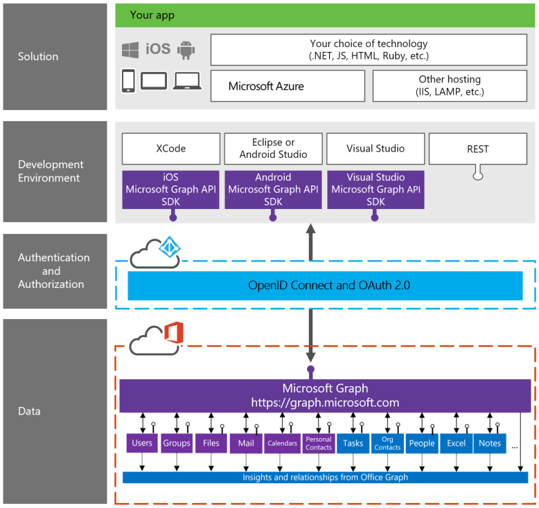

# Información general de Microsoft Graph

Microsoft Graph (anteriormente llamado API unificada de Office 365) expone varias API de los servicios en la nube de Microsoft a través de un único punto de conexión de la API de REST (**https://graph.microsoft.com**). Mediante Microsoft Graph, puede convertir las consultas que anteriormente resultaban difíciles o complejas en navegaciones simples. 
 
Microsoft Graph le proporciona:

- Un punto de conexión de la API unificado para el acceso a datos agregados de varios servicios en la nube de Microsoft en una sola respuesta 
- Navegación sin problemas entre las entidades y las relaciones entre ellos 
- Acceso a la inteligencia y a la información procedente de la nube de Microsoft

Y todo esto usando un único token de autenticación.

Puede usar la API para acceder a entidades fijas como usuarios, grupos, correo, mensajes, calendarios, tareas y notas que provienen de servicios como Outlook, OneDrive, Azure Active Directory, Planner, OneNote y otros. También puede obtener relaciones calculadas con tecnología de Office Graph (solo para usuarios comerciales) como la lista de usuarios en la que está trabajando o los documentos que son tendencia a su alrededor.

Microsoft Graph expone dos puntos de conexión. Punto de conexión /v1.0 (normalmente disponible) o punto de conexión de vista previa /beta.  Puede usar el punto de conexión /v1.0 en sus aplicaciones de producción, pero no el punto de conexión /beta.  El punto de conexión de vista previa /beta es donde ofrecemos las últimas características para que los desarrolladores experimenten y envíen comentarios. Las API de la versión beta pueden cambiar en cualquier momento y no están preparadas para el uso de producción.

<!---->

##Consultas comunes

Los siguientes son algunos ejemplos de consultas comunes mediante la API de Microsoft Graph:

| **Operación** | **Punto de conexión de servicio** |
|:--------------------------|:----------------------------------------|
|   OBTENER mi perfil |    `https://graph.microsoft.com/v1.0/me` |
|   OBTENER mis archivos|   `https://graph.microsoft.com/v1.0/me/drive/root/children` |
|   OBTENER mi foto     | `https://graph.microsoft.com/v1.0/me/photo/$value` |
|   OBTENER mi correo |   `https://graph.microsoft.com/v1.0/me/messages` |
|   OBTENER mi correo electrónico de importancia alta | `https://graph.microsoft.com/v1.0/me/messages?$filter=importance%20eq%20'high'` |
|   OBTENER mi calendario |   `https://graph.microsoft.com/v1.0/me/calendar` |
|   OBTENER mi administrador  | `https://graph.microsoft.com/v1.0/me/manager` |
|   OBTENER el último usuario que modificó el archivo foo.txt |  `https://graph.microsoft.com/v1.0/me/drive/root/children/foo.txt/lastModifiedByUser` |
|   OBTENER grupos unificados de los que soy miembro|   `https://graph.microsoft.com/v1.0/me/memberOf/$/microsoft.graph.group?$filter=groupTypes/any(a:a%20eq%20'unified')` |
|   OBTENER usuarios de mi organización     | `https://graph.microsoft.com/v1.0/users` |
|   OBTENER conversaciones de grupo |   `https://graph.microsoft.com/v1.0/groups/<id>/conversations` |
|   OBTENER usuarios relacionados conmigo    | `https://graph.microsoft.com/beta/me/people` |
|   OBTENER archivos de tendencias a mi alrededor |  `https://graph.microsoft.com/beta/me/trendingAround` |
|   OBTENER usuarios con las que estoy trabajando     | `https://graph.microsoft.com/beta/me/workingWith` |
|   OBTENER mis tareas    | `https://graph.microsoft.com/beta/me/tasks` |
|   OBTENER mis notas |  `https://graph.microsoft.com/beta/me/notes/notebooks` |

<!--  -->

## Todos los datos de Office 365 en un mismo lugar

El siguiente diagrama muestra el desarrollador de pila de Microsoft Graph y cómo funciona.

 >  Su opinión es importante para nosotros. Conecte con nosotros en [Stack Overflow](http://stackoverflow.com/questions/tagged/office365+or+microsoftgraph). Etiquete sus preguntas con [MicrosoftGraph] y [office365].

