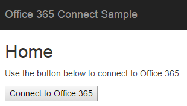

# Llamar a Microsoft Graph desde una aplicación de ASP.NET MVC

En este artículo veremos las tareas mínimas necesarias para conectar la aplicación a Office 365 y llamar a la API de Microsoft Graph. En este tema no crearemos una aplicación desde cero. Para explicar los conceptos principales que se deben implementar en la aplicación, usaremos el código del [ejemplo Office 365 ASP.NET MVC Connect con Microsoft Graph](https://github.com/microsoftgraph/aspnet-connect-rest-sample).

La siguiente es una captura de pantalla de la página de envío de correo.


## Información general

Para llamar a la API de Microsoft Graph, deben completarse las tareas siguientes.

1. Registrar la aplicación en Azure Active Directory
2. Llamar a métodos en la biblioteca de Azure de Active Directory (ADAL) para .NET para autenticar a un usuario y obtener un token de acceso (ADAL)
3. Obtener un token de acceso mediante ADAL
4. Usar el token de acceso en una solicitud a la API de Microsoft Graph
5. Desconectar sesión

<!--<a name="register"></a>-->
## Registrar la aplicación en Azure Active Directory

Antes de empezar a trabajar con Office 365, registre la aplicación y establezca los permisos para usar los servicios de Microsoft Graph. Con la [herramienta de registro de aplicaciones](https://dev.office.com/app-registration) puede registrar en pocos pasos su aplicación para que tenga acceso a la cuenta profesional o educativa de un usuario. Para administrarla, vaya al [Portal de administración de Microsoft Azure](https://manage.windowsazure.com).

Vea otras instrucciones en [Register your broswer-based web app with the Azure Management Portal](https://msdn.microsoft.com/office/office365/HowTo/add-common-consent-manually#bk_RegisterWebApp) (Registrar una aplicación web basada en el explorador con el Portal de administración de Azure) y tenga en cuenta lo siguiente.

* Asegúrese de especificar http://localhost:55065/ como la **URL de inicio de sesión**.
* Después de registrar la aplicación, [configure los **permisos delegados**](https://github.com/microsoftgraph/aspnet-connect-rest-sample/wiki/Grant-permissions-to-the-Connect-application-in-Azure) requeridos por la aplicación de Angular. El ejemplo Connect requiere el permiso **Enviar correo como usuario con sesión iniciada**.

Anote los siguientes valores de la página **Configurar** de la aplicación de Azure porque los necesitará para configurar la aplicación.

* Id. de cliente (exclusivo de la aplicación)
* Clave (también conocido como secreto de cliente)
* Dirección URL de respuesta (también conocida como URL de redireccionamiento). Para este ejemplo es http://localhost:55065/.

  > Nota:  El valor de la dirección URL de respuesta se rellena automáticamente con el valor de la URL de inicio de sesión que especifique al registrar la aplicación.

<!--<a name="#auth"></a>-->
## Autenticación en el ejemplo Connect

La biblioteca de autenticación de AD Azure (ADAL) para. NET permite a los desarrolladores de aplicaciones cliente autenticar a los usuarios y obtener tokens de acceso para hacer llamadas a la API.  Puede incluir esta biblioteca en el proyecto de ASP.NET MVC a través de **Administrar paquetes NuGet** en Visual Studio.

La siguiente es una captura de la página principal.



El flujo de autenticación se puede dividir en dos pasos básicos:

1. Solicitar un código de autorización
2. Usar el código de autorización para solicitar un token de acceso.

>  **Nota**: Junto con el token de acceso, también obtendrá token de actualización. Puede usar el token de actualización para adquirir un token de acceso nuevo cuando expire el actual.

Para la autenticación, el ejemplo Connect usa los valores del registro de aplicación de Azure y un identificador de usuario. El flujo de autenticación de ADAL necesita el identificador de cliente, la clave y una URL de respuesta (también denominada URL de redireccionamiento) que se obtienen en el proceso de registro de Azure.

Para solicitar un código de autorización, redirija primero la aplicación a la URL de solicitud de autorización de Azure AD, tal como se muestra a continuación (vea el archivo HomeController.cs).


```c#
        public ActionResult Login()
        {
            if (string.IsNullOrEmpty(Settings.ClientId) || string.IsNullOrEmpty(Settings.ClientSecret))
            {
                ViewBag.Message = "Please set your client ID and client secret in the Web.config file";
                return View();
            }


            var authContext = new AuthenticationContext(Settings.AzureADAuthority);

            // Generate the parameterized URL for Azure login.
            Uri authUri = authContext.GetAuthorizationRequestURL(
                Settings.O365UnifiedAPIResource,
                Settings.ClientId,
                loginRedirectUri,
                UserIdentifier.AnyUser,
                null);

            // Redirect the browser to the login page, then come back to the Authorize method below.
            return Redirect(authUri.ToString());
        }

```
Cuando se llame a este método **Login**, la aplicación redirigirá al usuario a una página de inicio de sesión. Esto llevará a la aplicación a la página de inicio de sesión. Una vez que las credenciales del usuario se han autenticado correctamente, Azure redirige la aplicación a la URL de redireccionamiento señalada en el código mediante *loginRedirectUri*. Como se puede ver, esta URL de redireccionamiento es una dirección a otra acción realizada en la aplicación ASP.NET MVC.

```c#

 Uri loginRedirectUri => new Uri(Url.Action(nameof(Authorize), "Home", null, Request.Url.Scheme));

```
La URL también contiene el código de autenticación mencionado en los pasos 1 y 2 anteriores.  Con esto se obtiene el código de autorización de los parámetros de la solicitud. Con el código de autorización, la aplicación realiza una llamada a Azure AD para obtener el token de acceso. Una vez que tenemos el token de acceso, lo almacenamos en la sesión para usarlo en varias solicitudes.

A continuación se muestra el aspecto de la acción Authorize mencionada en la acción de la URL de redireccionamiento.

```c#
        public async Task<ActionResult> Authorize()
        {
            var authContext = new AuthenticationContext(Settings.AzureADAuthority);


            // Get the token.
            var authResult = await authContext.AcquireTokenByAuthorizationCodeAsync(
                Request.Params["code"],                                         // the auth 'code' parameter from the Azure redirect.
                loginRedirectUri,                                               // same redirectUri as used before in Login method.
                new ClientCredential(Settings.ClientId, Settings.ClientSecret), // use the client ID and secret to establish app identity.
                Settings.O365UnifiedAPIResource);

            // Save the token in the session.
            Session[SessionKeys.Login.AccessToken] = authResult.AccessToken;

            // Get info about the current logged in user.
            Session[SessionKeys.Login.UserInfo] = await UnifiedApiHelper.GetUserInfoAsync(authResult.AccessToken);

            return RedirectToAction(nameof(Index), "Message");

        }

```
>  **Nota**:  Para más información sobre el flujo de autorización, vea [Flujo de concesión de códigos de autorización] (https://msdn.microsoft.com/es-ES/library/azure/dn645542.aspx).

<!--<a name="request"></a>-->
## Usar el token de acceso en una solicitud a la API de Microsoft Graph

Después de que el usuario inicia sesión, el ejemplo Connect muestra al usuario una actividad para el envío de un mensaje de correo.  El token de acceso permite a su aplicación efectuar solicitudes autenticadas en la API de Microsoft Graph.

Por ejemplo, el archivo UnifiedApiHelper.cs contiene el código que permite lo siguiente:

1)  Obtenga información sobre el usuario de inicio de sesión actual.  El método ``GetUserInfoAsync`` toma un único argumento (valor de token de acceso) para realizar una llamada a **https://graph.microsoft.com/v1.0/me** con el fin de obtener información sobre el usuario de inicio de sesión actual.

 ```c#

        public static async Task<UserInfo> GetUserInfoAsync(string accessToken)
        {
            UserInfo myInfo = new UserInfo();

            using (var client = new HttpClient())
            {
                using (var request = new HttpRequestMessage(HttpMethod.Get, Settings.GetMeUrl))
                {
                    request.Headers.Accept.Add(Json);
                    request.Headers.Authorization = new AuthenticationHeaderValue("Bearer", accessToken);

                    using (var response = await client.SendAsync(request))
                    {
                        if (response.StatusCode == HttpStatusCode.OK)
                        {
                            var json = JObject.Parse(await response.Content.ReadAsStringAsync());
                            myInfo.Name = json?["displayName"]?.ToString();
                            myInfo.Address = json?["mail"]?.ToString().Trim().Replace(" ", string.Empty);

                        }
                    }
                }
            }

            return myInfo;
        }

```


2)  Cree y envíe el mensaje que el usuario que ha iniciado sesión desea enviar por correo electrónico. El  método ``SendMessageAsync`` crea y envía una solicitud POST a la URL del recurso **https://graph.microsoft.com/v1.0/me/microsoft.graph.sendmail** con el valor del token de acceso como uno de los argumentos.


```c#

        public static async Task<SendMessageResponse> SendMessageAsync(string accessToken, SendMessageRequest sendMessageRequest)
        {
            var sendMessageResponse = new SendMessageResponse { Status = SendMessageStatusEnum.NotSent };

            using (var client = new HttpClient())
            {
                using (var request = new HttpRequestMessage(HttpMethod.Post, Settings.SendMessageUrl))
                {
                    request.Headers.Authorization = new AuthenticationHeaderValue("Bearer", accessToken);
                    request.Content = new StringContent(JsonConvert.SerializeObject(sendMessageRequest), Encoding.UTF8, "application/json");
                    using (HttpResponseMessage response = await client.SendAsync(request))
                    {
                        if (response.IsSuccessStatusCode)
                        {
                            sendMessageResponse.Status = SendMessageStatusEnum.Sent;
                            sendMessageResponse.StatusMessage = null;
                        }
                        else
                        {
                            sendMessageResponse.Status = SendMessageStatusEnum.Fail;
                            sendMessageResponse.StatusMessage = response.ReasonPhrase;
                        }
                    }
                }
            }

            return sendMessageResponse;
        }

```


El archivo ``MessageController.cs `` contiene código que administra los mensajes de correo electrónico. Por ejemplo, el botón **Enviar correo**. El método ``SendMessageSubmit `` envía el mensaje cuando los usuarios hacen clic en el botón **Enviar correo**.


```c#

        public async Task<ActionResult> SendMessageSubmit(UserInfo userInfo)
        {
            // After Index method renders the View, user clicks Send Mail, which comes in here.
            EnsureUser(ref userInfo);

            // Send email using O365 unified API.
            var sendMessageResult = await UnifiedApiHelper.SendMessageAsync(
                (string)Session[SessionKeys.Login.AccessToken],
                GenerateEmail(userInfo));

            // Reuse the Index view for messages (sent, not sent, fail) .
            // Redirect to tell the browser to call the app back via the Index method.
            return RedirectToAction(nameof(Index), new RouteValueDictionary(new Dictionary<string,object>{
                { "Status", sendMessageResult.Status },
                { "StatusMessage", sendMessageResult.StatusMessage },
                { "Address", userInfo.Address },
            }));
        }

```


El método ``CreateEmailObject`` crea el objeto de correo electrónico en el contrato de datos/formato de solicitud necesarios que requiere el cuerpo POST.


  ```c#

        private SendMessageRequest CreateEmailObject(UserInfo to, string subject, string body)
        {
            return new SendMessageRequest
            {
                Message = new Message
                {
                    Subject = subject,
                    Body = new MessageBody
                    {
                        ContentType = "Html",
                        Content = body
                    },
                    ToRecipients = new List<Recipient>
                    {
                        new Recipient
                        {
                            EmailAddress = new UserInfo
                            {
                                 Name =  to.Name,
                                 Address = to.Address
                            }
                        }
                    }
                },
                SaveToSentItems = true
            };

```

Otra tarea es construir una cadena de mensaje JSON válida y enviarla al punto de conexión ``https://graph.microsoft.com/v1.0/me/microsoft.graph.sendmail`` mediante una solicitud HTTP POST. Puesto que el cuerpo del correo electrónico se va a enviar como un documento HTML, la solicitud establece el valor ``ContentType`` del mensaje en HTML y codifica el contenido como JSON para la solicitud HTTP POST. El archivo UnifiedApiMessageModels.cs contiene los datos o los contratos de esquema establecidos entre esta aplicación y el servidor de la API unificada de Office 365.


```c#


    public class SendMessageResponse
    {
        public SendMessageStatusEnum Status { get; set; }
        public string StatusMessage { get; set; }
    }

    public class SendMessageRequest
    {
        public Message Message { get; set; }

        public bool SaveToSentItems { get; set; }
    }

    public class Message
    {
        public string Subject { get; set; }
        public MessageBody Body { get; set; }
        public List<Recipient> ToRecipients { get; set; }
    }
    public class Recipient
    {
        public UserInfo EmailAddress { get; set; }
    }

    public class MessageBody
    {
        public string ContentType { get; set; }
        public string Content { get; set; }
    }

    public class UserInfo
    {
        public string Name { get; set; }
        public string Address { get; set; }
    }

}

```
<!--<a name="logout"></a>-->
## Desconectar la sesión

Cuando el usuario hace clic en **Desconectar** en la página de envío de correo, la sesión del usuario se cierra. Para ello, el código debe:
* Borrar la sesión local
* Redirigir el explorador al punto de conexión de cierre de sesión (para que Azure pueda borrar sus propias cookies)

El método **Logout** (vea el archivo HomeController.cs) muestra cómo hacerlo.


```c#
        public ActionResult Logout()
        {
            Session.Clear();
            return Redirect(Settings.LogoutAuthority + logoutRedirectUri.ToString());
        }

```

##Pasos siguientes
La API de Microsoft Graph es una API unificadora muy potente que permite trabajar con todos los tipos de datos de Microsoft. Consulte la referencia de la API para ver todas las posibilidades que ofrece la API de Microsoft Graph. Consulte el resto de nuestros ejemplos ASP.NET en [GitHub](http://aka.ms/aspnetgraphsamples).


